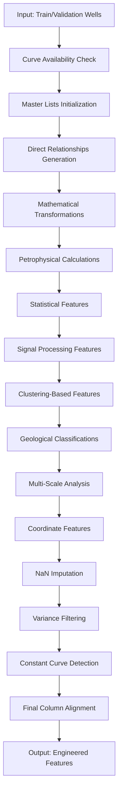

# Petrophysical Feature Engineering: From Raw Logs to Predictive Features

## Title and Purpose
This document describes the comprehensive feature engineering pipeline that transforms raw well log measurements into predictive features for machine learning models. The system generates approximately 101 engineered features from original well log curves through statistical transformations, geological calculations, and signal processing techniques, applying variance-based filtering and quality controls to ensure robust model performance.

## Workflow Description

The feature engineering pipeline follows a systematic approach to create meaningful features from raw well log data:

### Step 1: Input Data Validation and Preparation
1. **Well Data Processing**: Process train/validation well data after consistency correction
2. **Curve Availability Check**: Validate presence of required base curves
3. **Master Lists Initialization**: Set up feature tracking lists (`master_all`, `master_num`, `master_cat`, `master_coord`)
4. **Parameter Configuration**: Apply window sizes, clustering parameters, and variance thresholds

### Step 2: Base Feature Generation
1. **Direct Relationships**: Calculate ratios and differences between related curves
2. **Mathematical Transformations**: Apply logarithmic, exponential, and power transformations
3. **Petrophysical Calculations**: Compute geological properties using established equations
4. **Statistical Features**: Generate rolling statistics, gradients, and texture measures
5. **Signal Processing**: Extract frequency domain and entropy-based features

### Step 3: Advanced Feature Engineering
1. **Clustering-Based Features**: Create porosity and shale volume classifications using KMeans
2. **Geological Classifications**: Generate formation-specific categorical features
3. **Multi-Scale Analysis**: Apply different window sizes for temporal feature extraction
4. **Coordinate Features**: Include spatial information (latitude, longitude, well ID)

### Step 4: Quality Control and Filtering
1. **NaN Imputation**: Apply local median imputation for missing values
2. **Variance Filtering**: Remove low-variance features using dual-threshold approach
3. **Constant Curve Detection**: Handle flat curves with special unknown categories
4. **Final Column Alignment**: Ensure consistent feature structure across all wells



## Inputs and Outputs

### Inputs
- **train_validation_data**: `dict[str, pd.DataFrame]` - Well log data indexed by well name
- **selected_curves**: `list[str]` - Available base curves for feature generation
- **curves_to_predict**: `list[str]` - Target curves to exclude from features
- **window_size**: `int` - Rolling window size for statistical features (default: 5)
- **num_clusters**: `int` - Number of clusters for classification features (default: 10)
- **preserve_master**: `bool` - Whether to preserve master feature lists (default: False)

### Outputs
- **engineered_data**: `dict[str, pd.DataFrame]` - Engineered features indexed by well name
- **feature_info**: `dict[str, str]` - Feature type mapping ('numerical'/'categorical'/'coordinate')
- **final_columns**: `list[str]` - Final column order consistent across all wells

## Mathematical Explanation

### Direct Relationships
Features highlighting geological contrasts between related measurements:

**Resistivity Relationships**:
$$RILD\_minus\_RILM = RILD - RILM$$
$$RILD\_over\_RILM = \frac{RILD}{RILM + \epsilon}$$

**Density Relationships**:
$$RHOC\_minus\_RHOB = RHOC - RHOB$$

**Porosity Relationships**:
$$MN\_minus\_MI = MN - MI$$

### Petrophysical Calculations

**Shale Volume (Vsh)**:
$$V_{sh} = \frac{GR - GR_{min}}{GR_{max} - GR_{min}}$$

**Density Porosity (PhiD)**:
$$\Phi_D = \frac{\rho_{ma} - \rho_b}{\rho_{ma} - \rho_f}$$

Where $\rho_{ma} = 2.65$ g/cm³ (matrix density), $\rho_f = 1.0$ g/cm³ (fluid density)

**Sonic Porosity (PhiS)**:
$$\Phi_S = \frac{\Delta t - \Delta t_{ma}}{\Delta t_f - \Delta t_{ma}}$$

Where $\Delta t_{ma} = 55.5$ μs/ft, $\Delta t_f = 189$ μs/ft

**Average Porosity**:
$$\Phi_{avg} = \frac{\Phi_D + \Phi_S + \Phi_N}{N_{available}}$$

**Water Saturation (Archie's Equation)**:
$$S_w = \left(\frac{a \cdot R_w}{R_t \cdot \Phi_{avg}^m}\right)^{\frac{1}{n}}$$

Where $a = 1.0$, $m = 2.0$, $n = 2.0$, $R_w = 0.1$ Ω⋅m

**Permeability (Timur-Coates)**:
$$k = 0.136 \cdot \frac{\Phi_{avg}^{4.4}}{S_w^2}$$

**Bulk Volume Water (BVW)**:
$$BVW = \Phi_{avg} \cdot S_w$$

**Reservoir Quality Index (RQI)**:
$$RQI = 0.0314 \cdot \sqrt{\frac{k}{\Phi_{avg}}}$$

### Statistical Features

**Rolling Statistics**:
$$\text{Moving\_Avg}_i = \frac{1}{w} \sum_{j=i-\lfloor w/2 \rfloor}^{i+\lfloor w/2 \rfloor} x_j$$

$$\text{Moving\_Var}_i = \frac{1}{w} \sum_{j=i-\lfloor w/2 \rfloor}^{i+\lfloor w/2 \rfloor} (x_j - \text{Moving\_Avg}_i)^2$$

**Gradient Features**:
$$\text{Gradient}_i = x_{i+1} - x_i$$

**Autocorrelation**:
$$R_{xx}(\tau) = \frac{1}{N-\tau} \sum_{i=0}^{N-\tau-1} x_i \cdot x_{i+\tau}$$

### Signal Processing Features

**Permutation Entropy**:
$$H_p = -\sum_{\pi} p(\pi) \log p(\pi)$$

Where $\pi$ represents ordinal patterns of length $m = 3$

**Shannon Entropy**:
$$H = -\sum_{i=1}^{n} p_i \log_2 p_i$$

**Spectral Features (FFT)**:
$$X(k) = \sum_{n=0}^{N-1} x(n) e^{-j2\pi kn/N}$$

### Clustering-Based Classifications

**Porosity Classification (KMeans)**:
- Input: Normalized $[\Phi_D, \Phi_S, \Phi_N]$ where available
- Output: 10 cluster labels representing porosity regimes

**Shale-Water Saturation Classification**:
- Input: Normalized $[V_{sh}, S_w]$ 
- Output: 12 cluster labels representing combined shale-saturation states

**Shale Volume Classification**:
$$Vsh\_class = \begin{cases} 
    0 & \text{if } V_{sh} < 0.15 \text{ (clean)} \\
    1 & \text{if } 0.15 \leq V_{sh} < 0.35 \text{ (shaly)} \\
    2 & \text{if } V_{sh} \geq 0.35 \text{ (shale)} \\
    -1 & \text{if } V_{sh} \text{ has zero variance (unknown)}
\end{cases}$$

## Generated Features

The master feature list includes approximately 101 columns organized by category:

### 1. Direct Relationships (15 features)
- Resistivity contrasts: `RILD_minus_RILM`, `RILD_over_RILM`
- Density relationships: `RHOC_minus_RHOB`, `RHOB_over_RHOC`
- Porosity contrasts: `MN_minus_MI`, `DPOR_minus_SPOR`
- Gamma ray relationships: `GR_minus_SP`, `GR_over_SP`

### 2. Mathematical Transformations (12 features)
- Logarithmic: `Log_RILD`, `Log_RILM`, `Log_RHOB`
- Square root: `Sqrt_RHOC`, `Sqrt_GR`, `Sqrt_DT`
- Exponential: `Exp_normalized_GR`, `Exp_normalized_SP`

### 3. Petrophysical Properties (8 features)
- `Vsh`: Shale volume from gamma ray
- `PhiD`: Density porosity
- `PhiS`: Sonic porosity  
- `Phi_avg`: Average porosity
- `Sw_archie`: Water saturation (Archie)
- `k_timur`: Permeability (Timur-Coates)
- `BVW`: Bulk volume water
- `RQI`: Reservoir quality index

### 4. Statistical Features (25 features)
- Rolling averages: `{Curve}_Moving_Avg` for key curves
- Rolling variance: `{Curve}_Moving_Var`
- Gradients: `{Curve}_grad`, `{Curve}_grad_smooth`
- Percentiles: `{Curve}_p10`, `{Curve}_p50`, `{Curve}_p90`
- Moments: `{Curve}_skew`, `{Curve}_kurt`

### 5. Signal Processing Features (15 features)
- Local frequency: `{Curve}_LocalFreq`
- Entropy measures: `{Curve}_LocalEntropy`, `{Curve}_ShannonAdaptive`
- Complexity: `{Curve}_LocalComplexity`, `{Curve}_PermEntropy`
- Spectral: `{Curve}_FFT_mean`, `{Curve}_FFT_std`

### 6. Clustering Features (8 features)
- `Phi_class`: Porosity-based clustering (10 classes)
- `SwVsh_class`: Shale-saturation clustering (12 classes)
- `Vsh_class`: Shale volume classification (4 classes including unknown)
- `kmeans_cluster`: General KMeans clustering
- `agglo_cluster`: Agglomerative clustering

### 7. Geological Indicators (6 features)
- `is_shale`: Binary shale indicator ($V_{sh} \geq 0.35$)
- `is_carb`: Binary carbonate indicator
- `is_clean`: Binary clean sand indicator ($V_{sh} < 0.15$)
- Formation-specific indicators based on log responses

### 8. Coordinate Features (3 features)
- `Latitude`: Geographic latitude
- `Longitude`: Geographic longitude  
- `Well_ID`: Hash-based well identifier

### 9. Texture and Roughness Features (9 features)
- RMS measures: `{Curve}_RMS`, `{Curve}_RMS_div_var`
- Autocorrelation: `{Curve}_autocorr_lag1`, `{Curve}_autocorr_lag3`
- Texture descriptors for key curves

## Quality Control and Data Handling

### NaN Imputation Strategy
The pipeline implements local median imputation for missing values:

```python
def _impute_local(series, window_size=5):
    for i in range(len(series)):
        if pd.isna(series.iloc[i]):
            start = max(0, i - window_size // 2)
            end = min(len(series), i + window_size // 2 + 1)
            window_values = series.iloc[start:end].dropna()
            if len(window_values) > 0:
                series.iloc[i] = window_values.median()
            else:
                series.iloc[i] = series.median()  # Global fallback
```

### Variance-Based Filtering
Two-stage filtering approach removes uninformative features:

**Global Variance Filter**:
- Threshold: `VAR_THRESHOLD_FEATURES = 1e-3`
- Applied to concatenated data from all wells

**Per-Well Variance Filter**:
- Threshold: `PCT_WELLS_THRESHOLD = 0.7`
- Features constant in ≥70% of wells are removed

### Constant Curve Handling
For classification features with zero variance base curves:
- Assign special value `-1` (unknown category)
- Prevents NaN propagation in categorical features
- Maintains feature structure consistency

### Safe Mathematical Operations
Prevent division by zero and invalid operations:
- Use $\epsilon = 10^{-6}$ for safe denominators
- Apply clipping before logarithmic operations: $\max(x, \epsilon)$
- Handle negative values in power transformations

## Implementation Parameters

### Key Constants
- `ROLLING_WINDOW_SIZE = 5`: Window for statistical features
- `PHI_CLUSTERING_SIZE = 10`: Porosity classification clusters
- `SWVSH_CLUSTERING_SIZE = 12`: Shale-saturation clusters
- `MINIMUM_VARIANCE_THRESHOLD = 1e-6`: Minimum acceptable variance
- `EPSILON = 1e-6`: Safe operation threshold

### Geological Parameters
- `MATRIX_DENSITY = 2.65`: g/cm³ for sandstone matrix
- `FLUID_DENSITY = 1.0`: g/cm³ for water
- `MATRIX_TRANSIT_TIME = 55.5`: μs/ft for sandstone
- `FLUID_TRANSIT_TIME = 189`: μs/ft for water
- `ARCHIE_WATER_RESISTIVITY = 0.1`: Ω⋅m formation water resistivity

### Quality Control Thresholds
- `VAR_THRESHOLD_FEATURES = 1e-3`: Global variance threshold
- `PCT_WELLS_THRESHOLD = 0.7`: Per-well filtering threshold
- `SHALE_GR_THRESHOLD = 0.35`: Shale volume cutoff
- `CARBONATE_RHOB_THRESHOLD = 2.71`: Carbonate density indicator

## Code Reference

**Source**: `code/src/data_preprocessing/feature_engineering.py`

**Key Functions**:
- `generate_features()`: Main feature engineering pipeline
- `_generate_direct_relationships()`: Direct curve relationships
- `_generate_petrophysical_features()`: Geological property calculations
- `_generate_statistical_features()`: Rolling statistics and gradients
- `_generate_signal_processing_features()`: Frequency and entropy features
- `_generate_clustering_features()`: KMeans-based classifications
- `_impute_local()`: Local median imputation for missing values

**Related Modules**:
- `code/src/neural_network/hyperparameters.py`: Configuration parameters
- `code/src/neural_network/pipeline.py`: Pipeline integration (Step 2)
- `code/src/data_preprocessing/normalization.py`: Subsequent normalization (Step 3)

## Conclusion

This comprehensive feature engineering system transforms raw well log measurements into 101 predictive features through:

1. **Geological Relevance**: Features based on established petrophysical relationships and domain knowledge
2. **Multi-Scale Analysis**: Statistical and signal processing features capture patterns at different scales
3. **Robust Quality Control**: Variance filtering and NaN handling ensure reliable feature sets
4. **Consistent Structure**: All wells emerge with identical feature structure for model training
5. **Computational Efficiency**: Optimized implementations handle large datasets effectively

The pipeline balances feature richness with computational efficiency, providing machine learning models with geologically meaningful inputs while maintaining numerical stability and consistency across diverse well conditions. The dual-stage variance filtering approach ensures that only informative features are retained, improving model performance and reducing overfitting risk.
