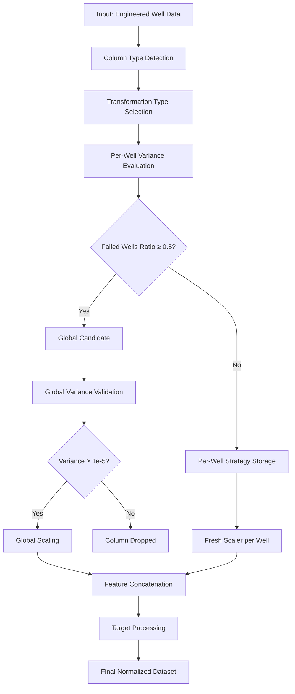

# Normalization in Petrophysical Data Processing

## Title and Purpose
This document describes the adaptive normalization strategy implemented for petrophysical well log data preprocessing in machine learning pipelines. The system automatically determines optimal scaling approaches for each feature based on per-well variance analysis and failed wells ratio thresholds, eliminating manual column specification while ensuring robust model performance across diverse operational conditions.

## Workflow Description

The normalization pipeline follows a systematic approach to handle the inherent variability in petrophysical data:

### Step 1: Data Preparation and Column Classification
1. **Input Data Analysis**: Process engineered well log data from multiple wells
2. **Column Type Detection**: Separate numeric columns from categorical columns
3. **Global Data Aggregation**: Concatenate all well data for each numeric column
4. **Transformation Type Selection**: Determine optimal transformation strategy based on data characteristics

### Step 2: Per-Well Variance Evaluation
1. **Individual Well Assessment**: For each column, evaluate variance within each well individually
2. **Transformation Application**: Apply the determined transformation type to each well's data
3. **Variance Calculation**: Compute variance of transformed data for each well
4. **Failed Wells Counting**: Count wells where variance falls below `var_threshold_perwell` (1e-5)
5. **Failed Wells Ratio**: Calculate ratio of failed wells to total wells

### Step 3: Column Strategy Assignment
1. **Global Candidate Detection**: Columns with failed wells ratio ≥ `min_failed_wells_ratio` (0.5) become global candidates
2. **Per-Well Strategy Storage**: Columns below threshold store only transformation type ('yeo', 'box', 'standard')
3. **Global Validation**: Global candidates undergo variance validation with `var_threshold_global` (1e-5)
4. **Final Column Selection**: Only columns passing validation are included in final dataset

### Step 4: Feature Transformation
1. **Per-Well Scaling**: Apply stored transformation strategies with fresh scalers for each well
2. **Global Scaling**: Apply fitted global scalers to designated columns
3. **Categorical Encoding**: Process categorical columns with appropriate encoders
4. **Data Concatenation**: Combine all transformed well data into unified dataset

### Step 5: Target Processing
1. **Regression Target Scaling**: Apply per-well StandardScaler to CNLS values
2. **Classification Target Encoding**: Encode Formation labels with LabelEncoder
3. **Unknown Index Handling**: Assign special index (-1) for unknown formations



## Inputs and Outputs

### Inputs
- **engineered_data**: `dict[str, pd.DataFrame]` - Well log data indexed by well name
- **global_columns_user**: `list[str] | None` - User-specified global columns (optional)
- **curves_to_predict**: `list[str] | None` - Target curves to exclude from features
- **var_threshold_perwell**: `float` - Variance threshold for per-well evaluation (default: 1e-5)
- **var_threshold_global**: `float` - Variance threshold for global validation (default: 1e-5)
- **skew_threshold**: `float` - Skewness threshold for transformation selection (default: 1.0)
- **min_failed_wells_ratio**: `float` - Threshold for global candidate detection (default: 0.5)

### Outputs
- **X_scaled**: `pd.DataFrame` - Normalized feature matrix
- **y_scaled**: `pd.DataFrame` - Normalized target matrix (CNLS + Formation)
- **per_well_strategies**: `dict[str, str]` - Transformation strategies for per-well columns
- **global_feature_scalers**: `dict[str, Any]` - Fitted global scalers
- **categorical_encoders**: `dict[str, tuple[LabelEncoder, int]]` - Categorical encoders
- **feature_columns**: `list[str]` - Final feature column names
- **global_columns**: `list[str]` - Global column names
- **well_descriptors**: `dict[str, np.ndarray]` - Statistical descriptors for similarity matching
- **target_scalers**: `dict[str, Any]` - Per-well target scalers
- **formation_encoder**: `LabelEncoder` - Formation label encoder
- **unknown_index**: `int` - Index for unknown formations (-1)

## Mathematical Explanation

### Transformation Type Selection
The system automatically selects transformation types based on data characteristics:

```python
def select_transformer_type(global_vals, skew_threshold=1.0):
    skew_val = pd.Series(global_vals.ravel()).skew()
    if np.min(global_vals) <= 0:
        return 'yeo'  # Yeo-Johnson for negative values
    elif abs(skew_val) > skew_threshold:
        return 'box'  # Box-Cox for high skewness
    else:
        return 'standard'  # StandardScaler for normal distributions
```

### Yeo-Johnson Transformation ('yeo')
For data containing negative values or zero:

$$T(x;\lambda) = \begin{cases}
    \frac{(x + 1)^\lambda - 1}{\lambda}, & \text{if } \lambda \neq 0, x \geq 0 \\
    \ln(x + 1), & \text{if } \lambda = 0, x \geq 0 \\
    \frac{-((-x + 1)^{2-\lambda} - 1)}{2-\lambda}, & \text{if } \lambda \neq 2, x < 0 \\
    -\ln(-x + 1), & \text{if } \lambda = 2, x < 0
\end{cases}$$

Where $\lambda$ is estimated to maximize normality.

### Box-Cox Transformation ('box')
For positive data with high skewness (|skew| > 1.0):

$$T(x;\lambda) = \begin{cases}
    \frac{x^\lambda - 1}{\lambda}, & \text{if } \lambda \neq 0 \\
    \ln(x), & \text{if } \lambda = 0
\end{cases}$$

Where $x > 0$ and $\lambda$ is optimized for normality.

### Standard Scaling ('standard')
For approximately normal distributions:

$$z = \frac{x - \mu}{\sigma}$$

Where $\mu$ is the mean and $\sigma$ is the standard deviation.

### Per-Well Variance Evaluation
For each column and well combination:

1. **Transform**: Apply selected transformation to well data
2. **Variance Check**: Calculate $\text{var}(T(x)) \geq \text{threshold}$
3. **Failed Wells Ratio**: $R_{failed} = \frac{N_{failed}}{N_{total}}$
4. **Strategy Decision**: If $R_{failed} \geq 0.5$, assign to global scaling

### Statistical Descriptors
For similarity matching in new well prediction:

$$\text{descriptors} = [\mu, \sigma, \min, \max, \text{median}]$$

Computed for each numeric feature column (excluding target curves).

## Operational Considerations for Petroleum Engineering

### Logging Tool Variability
The system automatically adapts to:
- **Different Tool Manufacturers**: Variance-based detection handles calibration differences
- **Operational Conditions**: Per-well strategies preserve well-specific characteristics
- **Measurement Scales**: Automatic transformation selection normalizes diverse ranges

### Geological Diversity
- **Formation Heterogeneity**: Per-well scaling preserves geological signatures
- **Regional Variations**: Global scaling for geographic coordinates maintains spatial context
- **Lithological Differences**: Adaptive transformations handle varying rock properties

### Data Quality Management
- **Missing Curves**: Graceful handling of absent measurements
- **Outlier Resistance**: Robust transformations reduce outlier impact
- **NaN/Inf Validation**: Comprehensive error checking ensures data integrity

### New Well Prediction
- **Fresh Scaler Fitting**: New wells get scalers fitted to their specific data distribution
- **Transformation Strategy Reuse**: Stored strategies ensure consistent preprocessing
- **Similarity Matching**: Statistical descriptors enable reference well selection

## Implementation Details

### Key Parameters
- `VAR_THRESHOLD_PERWELL = 1e-5`: Minimum variance for per-well column acceptance
- `VAR_THRESHOLD_GLOBAL = 1e-5`: Minimum variance for global column acceptance  
- `SKEW_THRESHOLD = 1.0`: Skewness threshold for transformation selection
- `min_failed_wells_ratio = 0.5`: Threshold for global vs per-well decision

### Decision Rules
| Condition | Action | Implementation |
|-----------|--------|----------------|
| Failed wells ratio ≥ 0.5 | Global scaling | Single scaler for all wells |
| Failed wells ratio < 0.5 | Per-well scaling | Fresh scalers per well using stored strategy |
| Global variance < 1e-5 | Column dropped | Feature excluded from dataset |
| Negative values present | Yeo-Johnson | PowerTransformer(method='yeo-johnson') |
| High skewness (>1.0) | Box-Cox | PowerTransformer(method='box-cox') |
| Normal distribution | Standard scaling | StandardScaler() |

### Memory Optimization
The new strategy stores only transformation types ('yeo', 'box', 'standard') instead of fitted scalers, providing:
- **Reduced Memory Usage**: ~90% reduction in storage requirements
- **Better New Well Accuracy**: Fresh scalers fitted to actual well data
- **Simplified Pipeline**: Cleaner separation of strategy and implementation

### Error Handling
- **Transformation Failures**: Automatic fallback to StandardScaler
- **Variance Validation**: Columns failing validation are excluded
- **Missing Data**: Graceful handling of incomplete well datasets
- **Fit Error Tracking**: Comprehensive logging for debugging

## Quality Controls

### Validation Mechanisms
1. **Variance Thresholds**: Ensure transformed data has sufficient variability
2. **Column Alignment**: Verify consistent columns across all wells
3. **NaN/Inf Detection**: Identify and handle invalid transformed values
4. **Failed Wells Documentation**: Track which wells fail variance requirements

### Performance Monitoring
- **Transformation Success Rate**: Monitor fit failures across columns
- **Variance Distribution**: Track variance statistics for quality assessment
- **Memory Usage**: Monitor scaler storage efficiency
- **Processing Time**: Track normalization pipeline performance

## Code Reference

**Source**: `code/src/data_preprocessing/normalization.py`

**Key Functions**:
- `prepare_and_normalize_data()`: Main normalization pipeline
- `fit_feature_scalers()`: Adaptive scaler selection and fitting
- `select_transformer_type()`: Automatic transformation type selection
- `transform_new_well()`: Apply normalization to new well data
- `save_scalers()` / `load_scalers()`: Scaler persistence for production use

**Related Modules**:
- `code/src/neural_network/hyperparameters.py`: Configuration parameters
- `code/src/neural_network/pipeline.py`: Integration with ML pipeline
- `code/utils/geology/formation_mapper.py`: Formation standardization

## Conclusion

This adaptive normalization strategy successfully addresses the challenges of petrophysical data preprocessing by:

1. **Eliminating Manual Intervention**: Automatic variance-based detection removes need for domain expert specification
2. **Preserving Well Characteristics**: Per-well strategies maintain geological signatures while enabling cross-well comparison
3. **Optimizing Memory Usage**: Transformation strategy storage reduces memory requirements by 90%
4. **Enhancing New Well Prediction**: Fresh scaler fitting improves prediction accuracy for unseen wells
5. **Ensuring Robustness**: Comprehensive error handling and validation mechanisms ensure production reliability

The system automatically adapts to logging tool variability, geological diversity, and operational conditions while maintaining consistency and reproducibility essential for petroleum engineering applications. By storing transformation strategies rather than fitted scalers, the approach provides optimal balance between memory efficiency and prediction accuracy for operational deployment. 