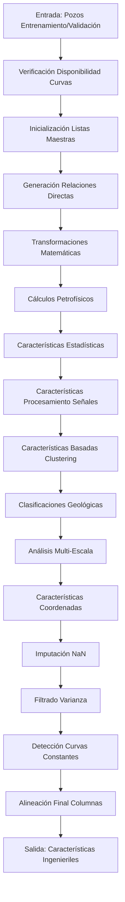

# Ingeniería de Características Petrofísicas: De Registros Crudos a Características Predictivas

## Título y Propósito
Este documento describe el pipeline integral de ingeniería de características que transforma mediciones crudas de registros de pozos en características predictivas para modelos de aprendizaje automático. El sistema genera aproximadamente 101 características ingenieriles a partir de curvas originales de registros de pozos mediante transformaciones estadísticas, cálculos geológicos y técnicas de procesamiento de señales, aplicando filtrado basado en varianza y controles de calidad para asegurar un rendimiento robusto del modelo.

## Descripción del Flujo de Trabajo

El pipeline de ingeniería de características sigue un enfoque sistemático para crear características significativas a partir de datos crudos de registros de pozos:

### Paso 1: Validación de Datos de Entrada y Preparación
1. **Procesamiento de Datos de Pozos**: Procesar datos de pozos de entrenamiento/validación después de corrección de consistencia
2. **Verificación de Disponibilidad de Curvas**: Validar presencia de curvas base requeridas
3. **Inicialización de Listas Maestras**: Configurar listas de seguimiento de características (`master_all`, `master_num`, `master_cat`, `master_coord`)
4. **Configuración de Parámetros**: Aplicar tamaños de ventana, parámetros de clustering y umbrales de varianza

### Paso 2: Generación de Características Base
1. **Relaciones Directas**: Calcular ratios y diferencias entre curvas relacionadas
2. **Transformaciones Matemáticas**: Aplicar transformaciones logarítmicas, exponenciales y de potencia
3. **Cálculos Petrofísicos**: Computar propiedades geológicas usando ecuaciones establecidas
4. **Características Estadísticas**: Generar estadísticas móviles, gradientes y medidas de textura
5. **Procesamiento de Señales**: Extraer características del dominio de frecuencia y basadas en entropía

### Paso 3: Ingeniería de Características Avanzada
1. **Características Basadas en Clustering**: Crear clasificaciones de porosidad y volumen de arcilla usando KMeans
2. **Clasificaciones Geológicas**: Generar características categóricas específicas de formación
3. **Análisis Multi-Escala**: Aplicar diferentes tamaños de ventana para extracción de características temporales
4. **Características de Coordenadas**: Incluir información espacial (latitud, longitud, ID de pozo)

### Paso 4: Control de Calidad y Filtrado
1. **Imputación de NaN**: Aplicar imputación de mediana local para valores faltantes
2. **Filtrado de Varianza**: Remover características de baja varianza usando enfoque de doble umbral
3. **Detección de Curvas Constantes**: Manejar curvas planas con categorías especiales desconocidas
4. **Alineación Final de Columnas**: Asegurar estructura de características consistente en todos los pozos



## Entradas y Salidas

### Entradas
- **train_validation_data**: `dict[str, pd.DataFrame]` - Datos de registros de pozos indexados por nombre de pozo
- **selected_curves**: `list[str]` - Curvas base disponibles para generación de características
- **curves_to_predict**: `list[str]` - Curvas objetivo a excluir de características
- **window_size**: `int` - Tamaño de ventana móvil para características estadísticas (por defecto: 5)
- **num_clusters**: `int` - Número de clusters para características de clasificación (por defecto: 10)
- **preserve_master**: `bool` - Si preservar listas maestras de características (por defecto: False)

### Salidas
- **engineered_data**: `dict[str, pd.DataFrame]` - Características ingenieriles indexadas por nombre de pozo
- **feature_info**: `dict[str, str]` - Mapeo de tipos de características ('numerical'/'categorical'/'coordinate')
- **final_columns**: `list[str]` - Orden final de columnas consistente en todos los pozos

## Explicación Matemática

### Relaciones Directas
Características que resaltan contrastes geológicos entre mediciones relacionadas:

**Relaciones de Resistividad**:
$$RILD\_minus\_RILM = RILD - RILM$$
$$RILD\_over\_RILM = \frac{RILD}{RILM + \epsilon}$$

**Relaciones de Densidad**:
$$RHOC\_minus\_RHOB = RHOC - RHOB$$

**Relaciones de Porosidad**:
$$MN\_minus\_MI = MN - MI$$

### Cálculos Petrofísicos

**Volumen de Arcilla (Vsh)**:
$$V_{sh} = \frac{GR - GR_{min}}{GR_{max} - GR_{min}}$$

**Porosidad por Densidad (PhiD)**:
$$\Phi_D = \frac{\rho_{ma} - \rho_b}{\rho_{ma} - \rho_f}$$

Donde $\rho_{ma} = 2.65$ g/cm³ (densidad de matriz), $\rho_f = 1.0$ g/cm³ (densidad de fluido)

**Porosidad Sónica (PhiS)**:
$$\Phi_S = \frac{\Delta t - \Delta t_{ma}}{\Delta t_f - \Delta t_{ma}}$$

Donde $\Delta t_{ma} = 55.5$ μs/ft, $\Delta t_f = 189$ μs/ft

**Porosidad Promedio**:
$$\Phi_{avg} = \frac{\Phi_D + \Phi_S + \Phi_N}{N_{disponible}}$$

**Saturación de Agua (Ecuación de Archie)**:
$$S_w = \left(\frac{a \cdot R_w}{R_t \cdot \Phi_{avg}^m}\right)^{\frac{1}{n}}$$

Donde $a = 1.0$, $m = 2.0$, $n = 2.0$, $R_w = 0.1$ Ω⋅m

**Permeabilidad (Timur-Coates)**:
$$k = 0.136 \cdot \frac{\Phi_{avg}^{4.4}}{S_w^2}$$

**Volumen de Agua Bruto (BVW)**:
$$BVW = \Phi_{avg} \cdot S_w$$

**Índice de Calidad de Reservorio (RQI)**:
$$RQI = 0.0314 \cdot \sqrt{\frac{k}{\Phi_{avg}}}$$

### Características Estadísticas

**Estadísticas Móviles**:
$$\text{Moving\_Avg}_i = \frac{1}{w} \sum_{j=i-\lfloor w/2 \rfloor}^{i+\lfloor w/2 \rfloor} x_j$$

$$\text{Moving\_Var}_i = \frac{1}{w} \sum_{j=i-\lfloor w/2 \rfloor}^{i+\lfloor w/2 \rfloor} (x_j - \text{Moving\_Avg}_i)^2$$

**Características de Gradiente**:
$$\text{Gradient}_i = x_{i+1} - x_i$$

**Autocorrelación**:
$$R_{xx}(\tau) = \frac{1}{N-\tau} \sum_{i=0}^{N-\tau-1} x_i \cdot x_{i+\tau}$$

### Características de Procesamiento de Señales

**Entropía de Permutación**:
$$H_p = -\sum_{\pi} p(\pi) \log p(\pi)$$

Donde $\pi$ representa patrones ordinales de longitud $m = 3$

**Entropía de Shannon**:
$$H = -\sum_{i=1}^{n} p_i \log_2 p_i$$

**Características Espectrales (FFT)**:
$$X(k) = \sum_{n=0}^{N-1} x(n) e^{-j2\pi kn/N}$$

### Clasificaciones Basadas en Clustering

**Clasificación de Porosidad (KMeans)**:
- Entrada: $[\Phi_D, \Phi_S, \Phi_N]$ normalizado donde esté disponible
- Salida: 10 etiquetas de cluster representando regímenes de porosidad

**Clasificación de Arcilla-Saturación de Agua**:
- Entrada: $[V_{sh}, S_w]$ normalizado
- Salida: 12 etiquetas de cluster representando estados combinados de arcilla-saturación

**Clasificación de Volumen de Arcilla**:
$$Vsh\_class = \begin{cases} 
    0 & \text{si } V_{sh} < 0.15 \text{ (limpio)} \\
    1 & \text{si } 0.15 \leq V_{sh} < 0.35 \text{ (arcilloso)} \\
    2 & \text{si } V_{sh} \geq 0.35 \text{ (arcilla)} \\
    -1 & \text{si } V_{sh} \text{ tiene varianza cero (desconocido)}
\end{cases}$$

## Características Generadas

La lista maestra de características incluye aproximadamente 101 columnas organizadas por categoría:

### 1. Relaciones Directas (15 características)
- Contrastes de resistividad: `RILD_minus_RILM`, `RILD_over_RILM`
- Relaciones de densidad: `RHOC_minus_RHOB`, `RHOB_over_RHOC`
- Contrastes de porosidad: `MN_minus_MI`, `DPOR_minus_SPOR`
- Relaciones de rayos gamma: `GR_minus_SP`, `GR_over_SP`

### 2. Transformaciones Matemáticas (12 características)
- Logarítmicas: `Log_RILD`, `Log_RILM`, `Log_RHOB`
- Raíz cuadrada: `Sqrt_RHOC`, `Sqrt_GR`, `Sqrt_DT`
- Exponenciales: `Exp_normalized_GR`, `Exp_normalized_SP`

### 3. Propiedades Petrofísicas (8 características)
- `Vsh`: Volumen de arcilla de rayos gamma
- `PhiD`: Porosidad por densidad
- `PhiS`: Porosidad sónica
- `Phi_avg`: Porosidad promedio
- `Sw_archie`: Saturación de agua (Archie)
- `k_timur`: Permeabilidad (Timur-Coates)
- `BVW`: Volumen de agua bruto
- `RQI`: Índice de calidad de reservorio

### 4. Características Estadísticas (25 características)
- Promedios móviles: `{Curve}_Moving_Avg` para curvas clave
- Varianza móvil: `{Curve}_Moving_Var`
- Gradientes: `{Curve}_grad`, `{Curve}_grad_smooth`
- Percentiles: `{Curve}_p10`, `{Curve}_p50`, `{Curve}_p90`
- Momentos: `{Curve}_skew`, `{Curve}_kurt`

### 5. Características de Procesamiento de Señales (15 características)
- Frecuencia local: `{Curve}_LocalFreq`
- Medidas de entropía: `{Curve}_LocalEntropy`, `{Curve}_ShannonAdaptive`
- Complejidad: `{Curve}_LocalComplexity`, `{Curve}_PermEntropy`
- Espectrales: `{Curve}_FFT_mean`, `{Curve}_FFT_std`

### 6. Características de Clustering (8 características)
- `Phi_class`: Clustering basado en porosidad (10 clases)
- `SwVsh_class`: Clustering arcilla-saturación (12 clases)
- `Vsh_class`: Clasificación volumen de arcilla (4 clases incluyendo desconocido)
- `kmeans_cluster`: Clustering KMeans general
- `agglo_cluster`: Clustering aglomerativo

### 7. Indicadores Geológicos (6 características)
- `is_shale`: Indicador binario de arcilla ($V_{sh} \geq 0.35$)
- `is_carb`: Indicador binario de carbonato
- `is_clean`: Indicador binario de arena limpia ($V_{sh} < 0.15$)
- Indicadores específicos de formación basados en respuestas de registros

### 8. Características de Coordenadas (3 características)
- `Latitude`: Latitud geográfica
- `Longitude`: Longitud geográfica
- `Well_ID`: Identificador de pozo basado en hash

### 9. Características de Textura y Rugosidad (9 características)
- Medidas RMS: `{Curve}_RMS`, `{Curve}_RMS_div_var`
- Autocorrelación: `{Curve}_autocorr_lag1`, `{Curve}_autocorr_lag3`
- Descriptores de textura para curvas clave

## Control de Calidad y Manejo de Datos

### Estrategia de Imputación de NaN
El pipeline implementa imputación de mediana local para valores faltantes:

```python
def _impute_local(series, window_size=5):
    for i in range(len(series)):
        if pd.isna(series.iloc[i]):
            start = max(0, i - window_size // 2)
            end = min(len(series), i + window_size // 2 + 1)
            window_values = series.iloc[start:end].dropna()
            if len(window_values) > 0:
                series.iloc[i] = window_values.median()
            else:
                series.iloc[i] = series.median()  # Respaldo global
```

### Filtrado Basado en Varianza
Enfoque de filtrado de dos etapas remueve características no informativas:

**Filtro de Varianza Global**:
- Umbral: `VAR_THRESHOLD_FEATURES = 1e-3`
- Aplicado a datos concatenados de todos los pozos

**Filtro de Varianza por Pozo**:
- Umbral: `PCT_WELLS_THRESHOLD = 0.7`
- Características constantes en ≥70% de pozos son removidas

### Manejo de Curvas Constantes
Para características de clasificación con curvas base de varianza cero:
- Asignar valor especial `-1` (categoría desconocida)
- Previene propagación de NaN en características categóricas
- Mantiene consistencia de estructura de características

### Operaciones Matemáticas Seguras
Prevenir división por cero y operaciones inválidas:
- Usar $\epsilon = 10^{-6}$ para denominadores seguros
- Aplicar recorte antes de operaciones logarítmicas: $\max(x, \epsilon)$
- Manejar valores negativos en transformaciones de potencia

## Parámetros de Implementación

### Constantes Clave
- `ROLLING_WINDOW_SIZE = 5`: Ventana para características estadísticas
- `PHI_CLUSTERING_SIZE = 10`: Clusters de clasificación de porosidad
- `SWVSH_CLUSTERING_SIZE = 12`: Clusters arcilla-saturación
- `MINIMUM_VARIANCE_THRESHOLD = 1e-6`: Varianza mínima aceptable
- `EPSILON = 1e-6`: Umbral de operación segura

### Parámetros Geológicos
- `MATRIX_DENSITY = 2.65`: g/cm³ para matriz de arenisca
- `FLUID_DENSITY = 1.0`: g/cm³ para agua
- `MATRIX_TRANSIT_TIME = 55.5`: μs/ft para arenisca
- `FLUID_TRANSIT_TIME = 189`: μs/ft para agua
- `ARCHIE_WATER_RESISTIVITY = 0.1`: Ω⋅m resistividad de agua de formación

### Umbrales de Control de Calidad
- `VAR_THRESHOLD_FEATURES = 1e-3`: Umbral de varianza global
- `PCT_WELLS_THRESHOLD = 0.7`: Umbral de filtrado por pozo
- `SHALE_GR_THRESHOLD = 0.35`: Corte de volumen de arcilla
- `CARBONATE_RHOB_THRESHOLD = 2.71`: Indicador de densidad de carbonato

## Referencia de Código

**Fuente**: `code/src/data_preprocessing/feature_engineering.py`

**Funciones Clave**:
- `generate_features()`: Pipeline principal de ingeniería de características
- `_generate_direct_relationships()`: Relaciones directas de curvas
- `_generate_petrophysical_features()`: Cálculos de propiedades geológicas
- `_generate_statistical_features()`: Estadísticas móviles y gradientes
- `_generate_signal_processing_features()`: Características de frecuencia y entropía
- `_generate_clustering_features()`: Clasificaciones basadas en KMeans
- `_impute_local()`: Imputación de mediana local para valores faltantes

**Módulos Relacionados**:
- `code/src/neural_network/hyperparameters.py`: Parámetros de configuración
- `code/src/neural_network/pipeline.py`: Integración de pipeline (Paso 2)
- `code/src/data_preprocessing/normalization.py`: Normalización subsecuente (Paso 3)

## Conclusión

Este sistema integral de ingeniería de características transforma mediciones crudas de registros de pozos en 101 características predictivas mediante:

1. **Relevancia Geológica**: Características basadas en relaciones petrofísicas establecidas y conocimiento de dominio
2. **Análisis Multi-Escala**: Características estadísticas y de procesamiento de señales capturan patrones a diferentes escalas
3. **Control de Calidad Robusto**: Filtrado de varianza y manejo de NaN aseguran conjuntos de características confiables
4. **Estructura Consistente**: Todos los pozos emergen con estructura de características idéntica para entrenamiento de modelos
5. **Eficiencia Computacional**: Implementaciones optimizadas manejan conjuntos de datos grandes efectivamente

El pipeline equilibra riqueza de características con eficiencia computacional, proporcionando a los modelos de aprendizaje automático entradas geológicamente significativas mientras mantiene estabilidad numérica y consistencia a través de diversas condiciones de pozos. El enfoque de filtrado de varianza de doble etapa asegura que solo características informativas sean retenidas, mejorando el rendimiento del modelo y reduciendo el riesgo de sobreajuste.
