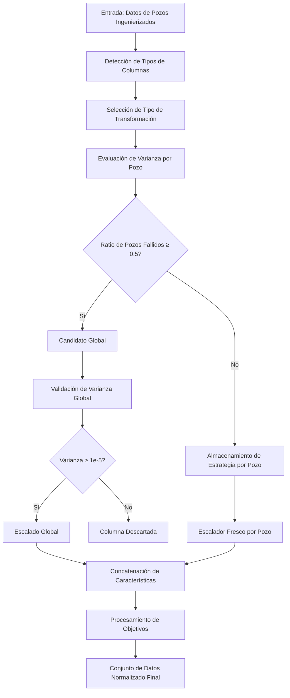

# Normalización en el Procesamiento de Datos Petrofísicos

## Título y Propósito
Este documento describe la estrategia de normalización adaptativa implementada para el preprocesamiento de datos de registros petrofísicos en pipelines de aprendizaje automático. El sistema determina automáticamente enfoques de escalado óptimos para cada característica basándose en análisis de varianza por pozo y umbrales de ratio de pozos fallidos, eliminando la especificación manual de columnas mientras asegura un rendimiento robusto del modelo en diversas condiciones operacionales.

## Descripción del Flujo de Trabajo

El pipeline de normalización sigue un enfoque sistemático para manejar la variabilidad inherente en los datos petrofísicos:

### Paso 1: Preparación de Datos y Clasificación de Columnas
1. **Análisis de Datos de Entrada**: Procesar datos de registros de pozos ingenierizados de múltiples pozos
2. **Detección de Tipos de Columnas**: Separar columnas numéricas de columnas categóricas
3. **Agregación Global de Datos**: Concatenar todos los datos de pozos para cada columna numérica
4. **Selección de Tipo de Transformación**: Determinar estrategia de transformación óptima basada en características de los datos

### Paso 2: Evaluación de Varianza por Pozo
1. **Evaluación Individual de Pozos**: Para cada columna, evaluar varianza dentro de cada pozo individualmente
2. **Aplicación de Transformación**: Aplicar el tipo de transformación determinado a los datos de cada pozo
3. **Cálculo de Varianza**: Computar varianza de datos transformados para cada pozo
4. **Conteo de Pozos Fallidos**: Contar pozos donde la varianza cae por debajo de `var_threshold_perwell` (1e-5)
5. **Ratio de Pozos Fallidos**: Calcular ratio de pozos fallidos a pozos totales

### Paso 3: Asignación de Estrategia de Columnas
1. **Detección de Candidatos Globales**: Columnas con ratio de pozos fallidos ≥ `min_failed_wells_ratio` (0.5) se convierten en candidatos globales
2. **Almacenamiento de Estrategia por Pozo**: Columnas por debajo del umbral almacenan solo tipo de transformación ('yeo', 'box', 'standard')
3. **Validación Global**: Candidatos globales se someten a validación de varianza con `var_threshold_global` (1e-5)
4. **Selección Final de Columnas**: Solo columnas que pasan validación se incluyen en el conjunto de datos final

### Paso 4: Transformación de Características
1. **Escalado por Pozo**: Aplicar estrategias de transformación almacenadas con escaladores frescos para cada pozo
2. **Escalado Global**: Aplicar escaladores globales ajustados a columnas designadas
3. **Codificación Categórica**: Procesar columnas categóricas con codificadores apropiados
4. **Concatenación de Datos**: Combinar todos los datos de pozos transformados en conjunto de datos unificado

### Paso 5: Procesamiento de Objetivos
1. **Escalado de Objetivo de Regresión**: Aplicar StandardScaler por pozo a valores CNLS
2. **Codificación de Objetivo de Clasificación**: Codificar etiquetas de Formación con LabelEncoder
3. **Manejo de Índice Desconocido**: Asignar índice especial (-1) para formaciones desconocidas



## Entradas y Salidas

### Entradas
- **engineered_data**: `dict[str, pd.DataFrame]` - Datos de registros de pozos indexados por nombre de pozo
- **global_columns_user**: `list[str] | None` - Columnas globales especificadas por usuario (opcional)
- **curves_to_predict**: `list[str] | None` - Curvas objetivo a excluir de características
- **var_threshold_perwell**: `float` - Umbral de varianza para evaluación por pozo (por defecto: 1e-5)
- **var_threshold_global**: `float` - Umbral de varianza para validación global (por defecto: 1e-5)
- **skew_threshold**: `float` - Umbral de asimetría para selección de transformación (por defecto: 1.0)
- **min_failed_wells_ratio**: `float` - Umbral para detección de candidatos globales (por defecto: 0.5)

### Salidas
- **X_scaled**: `pd.DataFrame` - Matriz de características normalizada
- **y_scaled**: `pd.DataFrame` - Matriz de objetivos normalizada (CNLS + Formación)
- **per_well_strategies**: `dict[str, str]` - Estrategias de transformación para columnas por pozo
- **global_feature_scalers**: `dict[str, Any]` - Escaladores globales ajustados
- **categorical_encoders**: `dict[str, tuple[LabelEncoder, int]]` - Codificadores categóricos
- **feature_columns**: `list[str]` - Nombres de columnas de características finales
- **global_columns**: `list[str]` - Nombres de columnas globales
- **well_descriptors**: `dict[str, np.ndarray]` - Descriptores estadísticos para matching de similitud
- **target_scalers**: `dict[str, Any]` - Escaladores de objetivos por pozo
- **formation_encoder**: `LabelEncoder` - Codificador de etiquetas de formación
- **unknown_index**: `int` - Índice para formaciones desconocidas (-1)

## Explicación Matemática

### Selección de Tipo de Transformación
El sistema selecciona automáticamente tipos de transformación basándose en características de los datos:

```python
def select_transformer_type(global_vals, skew_threshold=1.0):
    skew_val = pd.Series(global_vals.ravel()).skew()
    if np.min(global_vals) <= 0:
        return 'yeo'  # Yeo-Johnson para valores negativos
    elif abs(skew_val) > skew_threshold:
        return 'box'  # Box-Cox para alta asimetría
    else:
        return 'standard'  # StandardScaler para distribuciones normales
```

### Transformación Yeo-Johnson ('yeo')
Para datos que contienen valores negativos o cero:

$$T(x;\lambda) = \begin{cases}
    \frac{(x + 1)^\lambda - 1}{\lambda}, & \text{si } \lambda \neq 0, x \geq 0 \\
    \ln(x + 1), & \text{si } \lambda = 0, x \geq 0 \\
    \frac{-((-x + 1)^{2-\lambda} - 1)}{2-\lambda}, & \text{si } \lambda \neq 2, x < 0 \\
    -\ln(-x + 1), & \text{si } \lambda = 2, x < 0
\end{cases}$$

Donde $\lambda$ se estima para maximizar la normalidad.

### Transformación Box-Cox ('box')
Para datos positivos con alta asimetría (|asimetría| > 1.0):

$$T(x;\lambda) = \begin{cases}
    \frac{x^\lambda - 1}{\lambda}, & \text{si } \lambda \neq 0 \\
    \ln(x), & \text{si } \lambda = 0
\end{cases}$$

Donde $x > 0$ y $\lambda$ se optimiza para normalidad.

### Escalado Estándar ('standard')
Para distribuciones aproximadamente normales:

$$z = \frac{x - \mu}{\sigma}$$

Donde $\mu$ es la media y $\sigma$ es la desviación estándar.

### Evaluación de Varianza por Pozo
Para cada combinación de columna y pozo:

1. **Transformar**: Aplicar transformación seleccionada a datos del pozo
2. **Verificación de Varianza**: Calcular $\text{var}(T(x)) \geq \text{umbral}$
3. **Ratio de Pozos Fallidos**: $R_{fallidos} = \frac{N_{fallidos}}{N_{total}}$
4. **Decisión de Estrategia**: Si $R_{fallidos} \geq 0.5$, asignar a escalado global

### Descriptores Estadísticos
Para matching de similitud en predicción de nuevos pozos:

$$\text{descriptores} = [\mu, \sigma, \min, \max, \text{mediana}]$$

Computados para cada columna de característica numérica (excluyendo curvas objetivo).

## Consideraciones Operacionales para Ingeniería Petrolera

### Variabilidad de Herramientas de Registro
El sistema se adapta automáticamente a:
- **Diferentes Fabricantes de Herramientas**: Detección basada en varianza maneja diferencias de calibración
- **Condiciones Operacionales**: Estrategias por pozo preservan características específicas del pozo
- **Escalas de Medición**: Selección automática de transformación normaliza rangos diversos

### Diversidad Geológica
- **Heterogeneidad de Formaciones**: Escalado por pozo preserva firmas geológicas
- **Variaciones Regionales**: Escalado global para coordenadas geográficas mantiene contexto espacial
- **Diferencias Litológicas**: Transformaciones adaptativas manejan propiedades variables de rocas

### Gestión de Calidad de Datos
- **Curvas Faltantes**: Manejo elegante de mediciones ausentes
- **Resistencia a Outliers**: Transformaciones robustas reducen impacto de outliers
- **Validación NaN/Inf**: Verificación de errores integral asegura integridad de datos

### Predicción de Nuevos Pozos
- **Ajuste de Escalador Fresco**: Nuevos pozos obtienen escaladores ajustados a su distribución específica de datos
- **Reutilización de Estrategia de Transformación**: Estrategias almacenadas aseguran preprocesamiento consistente
- **Matching de Similitud**: Descriptores estadísticos permiten selección de pozo de referencia

## Detalles de Implementación

### Parámetros Clave
- `VAR_THRESHOLD_PERWELL = 1e-5`: Varianza mínima para aceptación de columna por pozo
- `VAR_THRESHOLD_GLOBAL = 1e-5`: Varianza mínima para aceptación de columna global
- `SKEW_THRESHOLD = 1.0`: Umbral de asimetría para selección de transformación
- `min_failed_wells_ratio = 0.5`: Umbral para decisión global vs por pozo

### Reglas de Decisión
| Condición | Acción | Implementación |
|-----------|--------|----------------|
| Ratio de pozos fallidos ≥ 0.5 | Escalado global | Escalador único para todos los pozos |
| Ratio de pozos fallidos < 0.5 | Escalado por pozo | Escaladores frescos por pozo usando estrategia almacenada |
| Varianza global < 1e-5 | Columna descartada | Característica excluida del conjunto de datos |
| Valores negativos presentes | Yeo-Johnson | PowerTransformer(method='yeo-johnson') |
| Alta asimetría (>1.0) | Box-Cox | PowerTransformer(method='box-cox') |
| Distribución normal | Escalado estándar | StandardScaler() |

### Optimización de Memoria
La nueva estrategia almacena solo tipos de transformación ('yeo', 'box', 'standard') en lugar de escaladores ajustados, proporcionando:
- **Uso Reducido de Memoria**: ~90% de reducción en requerimientos de almacenamiento
- **Mejor Precisión para Nuevos Pozos**: Escaladores frescos ajustados a datos reales del pozo
- **Pipeline Simplificado**: Separación más limpia de estrategia e implementación

### Manejo de Errores
- **Fallas de Transformación**: Fallback automático a StandardScaler
- **Validación de Varianza**: Columnas que fallan validación son excluidas
- **Datos Faltantes**: Manejo elegante de conjuntos de datos de pozos incompletos
- **Seguimiento de Errores de Ajuste**: Logging integral para depuración

## Controles de Calidad

### Mecanismos de Validación
1. **Umbrales de Varianza**: Asegurar que datos transformados tengan suficiente variabilidad
2. **Alineación de Columnas**: Verificar columnas consistentes en todos los pozos
3. **Detección NaN/Inf**: Identificar y manejar valores transformados inválidos
4. **Documentación de Pozos Fallidos**: Rastrear qué pozos fallan requerimientos de varianza

### Monitoreo de Rendimiento
- **Tasa de Éxito de Transformación**: Monitorear fallas de ajuste en columnas
- **Distribución de Varianza**: Rastrear estadísticas de varianza para evaluación de calidad
- **Uso de Memoria**: Monitorear eficiencia de almacenamiento de escaladores
- **Tiempo de Procesamiento**: Rastrear rendimiento del pipeline de normalización

## Referencia de Código

**Fuente**: `code/src/data_preprocessing/normalization.py`

**Funciones Clave**:
- `prepare_and_normalize_data()`: Pipeline principal de normalización
- `fit_feature_scalers()`: Selección y ajuste adaptativo de escaladores
- `select_transformer_type()`: Selección automática de tipo de transformación
- `transform_new_well()`: Aplicar normalización a datos de nuevo pozo
- `save_scalers()` / `load_scalers()`: Persistencia de escaladores para uso en producción

**Módulos Relacionados**:
- `code/src/neural_network/hyperparameters.py`: Parámetros de configuración
- `code/src/neural_network/pipeline.py`: Integración con pipeline de ML
- `code/utils/geology/formation_mapper.py`: Estandarización de formaciones

## Conclusión

Esta estrategia de normalización adaptativa aborda exitosamente los desafíos del preprocesamiento de datos petrofísicos mediante:

1. **Eliminación de Intervención Manual**: Detección automática basada en varianza elimina necesidad de especificación por experto de dominio
2. **Preservación de Características de Pozos**: Estrategias por pozo mantienen firmas geológicas mientras permiten comparación entre pozos
3. **Optimización de Uso de Memoria**: Almacenamiento de estrategias de transformación reduce requerimientos de memoria en 90%
4. **Mejora de Predicción de Nuevos Pozos**: Ajuste de escalador fresco mejora precisión de predicción para pozos no vistos
5. **Aseguramiento de Robustez**: Mecanismos integrales de manejo de errores y validación aseguran confiabilidad en producción

El sistema se adapta automáticamente a variabilidad de herramientas de registro, diversidad geológica y condiciones operacionales mientras mantiene consistencia y reproducibilidad esenciales para aplicaciones de ingeniería petrolera. Al almacenar estrategias de transformación en lugar de escaladores ajustados, el enfoque proporciona balance óptimo entre eficiencia de memoria y precisión de predicción para despliegue operacional. 