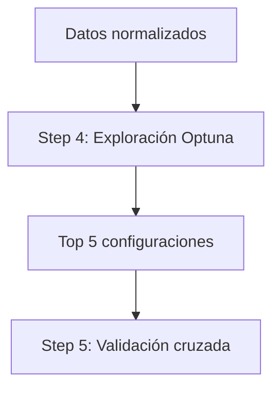
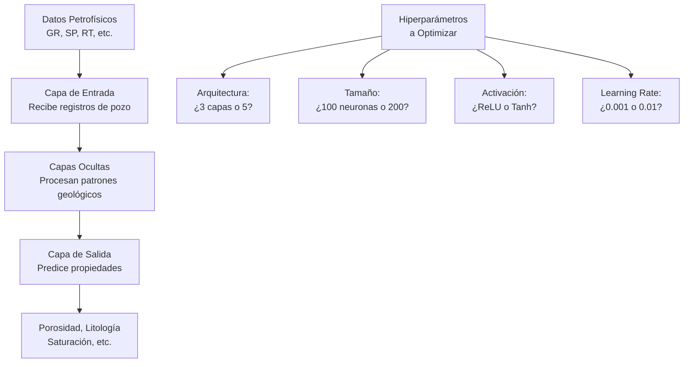
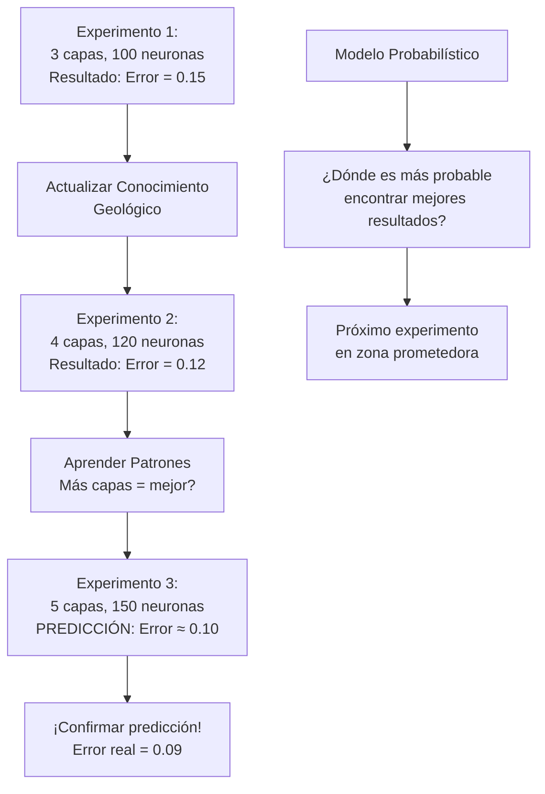
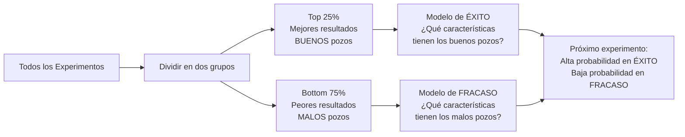
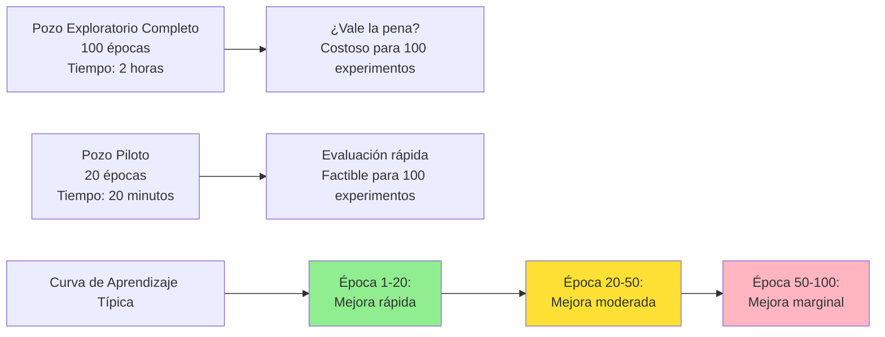
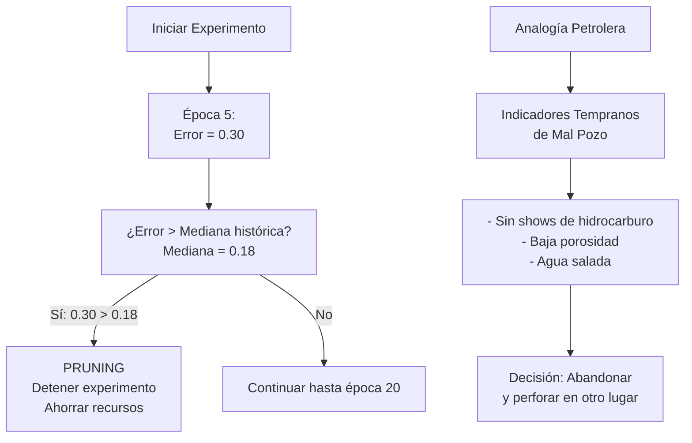
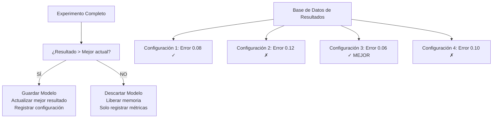
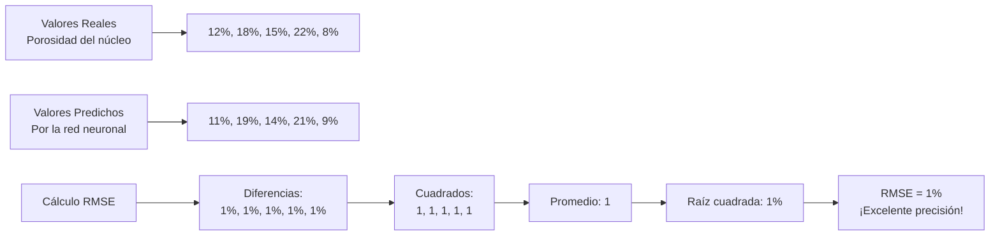
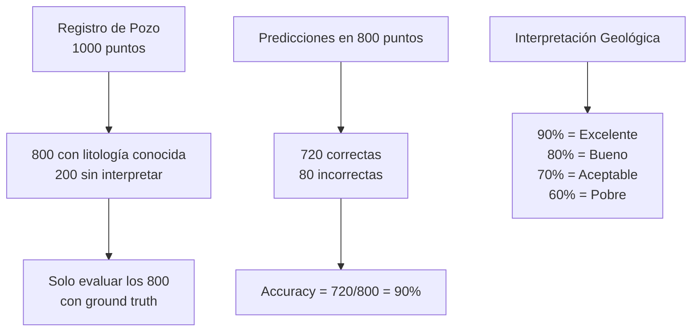
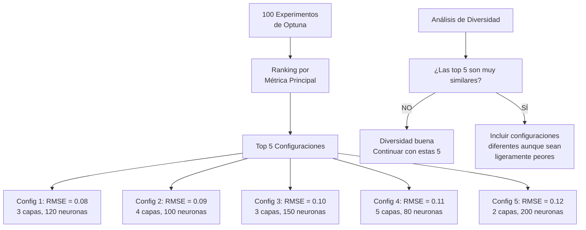

# Step 4: Hyperparameter Optimization

## Propósito
Este paso implementa la optimización de hiperparámetros usando Optuna, correspondiendo exactamente al **Step 4** del pipeline principal. Su función es explorar eficientemente el espacio de configuraciones posibles para identificar las arquitecturas de red neuronal más prometedoras antes de proceder a la validación exhaustiva.

## Descripción del Workflow

**¿Qué problema estamos resolviendo?**
Después de la normalización de datos (Step 3), enfrentamos una pregunta fundamental: ¿qué configuración de red neuronal funcionará mejor para nuestro tipo específico de tarea?

**¿Por qué no probar todas las combinaciones?**
El espacio de hiperparámetros es vasto. Si consideramos solo algunos parámetros básicos:
- Número de capas: 4 opciones
- Neuronas por capa: 5 opciones  
- Learning rate: 4 opciones
- Función de activación: 3 opciones

Esto resulta en 4×5×4×3 = 240 combinaciones. Entrenar cada una completamente sería computacionalmente prohibitivo.

**¿Cómo resuelve esto Optuna?**
Optuna usa optimización bayesiana para aprender de experimentos anteriores y sugerir configuraciones prometedoras, reduciendo dramáticamente el número de experimentos necesarios.

**Secuencia de operaciones:**
1. Definir rangos de búsqueda para cada hiperparámetro
2. Ejecutar entrenamientos rápidos (20 épocas) con diferentes configuraciones
3. Evaluar cada configuración con métricas específicas de la tarea
4. Seleccionar las top-N configuraciones para el siguiente paso



## Entradas y Salidas
- **Entradas**:
  - Datos ya normalizados y listos para entrenamiento
  - Definición de hiperparámetros a explorar
  - Tarea a resolver (regresión, clasificación, ambas)
- **Salidas**:
  - Lista de las configuraciones más prometedoras (top N)
  - Modelos entrenados rápidamente para cada configuración

## Fundamentos Técnicos

### ¿Qué son los Hiperparámetros en Redes Neuronales?

**¿Qué diferencia a los hiperparámetros de los parámetros del modelo?**
Los parámetros del modelo (pesos y sesgos) se aprenden durante el entrenamiento. Los hiperparámetros, en cambio, son configuraciones que debemos establecer antes del entrenamiento y que determinan:

**Arquitectura del modelo:**
- **Número de capas**: ¿Cuántas capas ocultas necesitamos?
- **Neuronas por capa**: ¿Qué capacidad de representación requerimos?
- **Función de activación**: ¿Qué no linealidades introducir?

**Proceso de entrenamiento:**
- **Learning rate**: ¿Qué tan agresivamente actualizar los pesos?
- **Batch size**: ¿Cuántas muestras procesar simultáneamente?
- **Dropout**: ¿Qué nivel de regularización aplicar?



### ¿Por qué Optimización Bayesiana en lugar de Métodos Tradicionales?

#### ¿Por qué los Métodos Tradicionales son Limitados?

**Grid Search - Búsqueda Exhaustiva:**
```
Hiperparámetros a probar:
- Capas: [2, 3, 4, 5]
- Neuronas: [50, 100, 150, 200]
- Learning Rate: [0.001, 0.01, 0.1]
- Activación: [ReLU, Tanh, Sigmoid]

Total de combinaciones: 4 × 4 × 3 × 3 = 144 experimentos
```

**¿Cuál es el problema?** Grid search garantiza encontrar la mejor combinación dentro del espacio definido, pero el costo computacional crece exponencialmente con cada nuevo hiperparámetro.

**Random Search - Búsqueda Aleatoria:**
```
Se eligen combinaciones al azar:
Experimento 1: 3 capas, 75 neuronas, LR=0.005, ReLU
Experimento 2: 5 capas, 180 neuronas, LR=0.08, Tanh
...
```

**¿Cuándo es útil?** Random search puede ser más eficiente que grid search cuando solo algunos hiperparámetros son realmente importantes, pero sigue sin aprender de experimentos anteriores.

#### Optimización Bayesiana - El Enfoque Inteligente

**¿Cómo funciona la Optimización Bayesiana?**

La optimización bayesiana mantiene un modelo probabilístico del espacio de hiperparámetros que se actualiza con cada experimento:



**Componentes Clave de la Optimización Bayesiana:**

1. **Modelo Sustituto (Surrogate Model):**
   - Mantiene una representación probabilística del espacio de hiperparámetros
   - Se actualiza con cada nuevo experimento realizado
   - Predice qué tan bueno será un experimento antes de ejecutarlo

2. **Función de Adquisición:**
   - Define el criterio para seleccionar el próximo experimento
   - Balancea **exploración** vs **explotación**
   - Exploración: "Evaluar regiones con alta incertidumbre"
   - Explotación: "Evaluar cerca de configuraciones prometedoras"

### Tree-Structured Parzen Estimator (TPE) - El Algoritmo de Optuna

**¿Qué es TPE?**

TPE es el algoritmo específico que usa Optuna para la optimización bayesiana. Funciona creando dos modelos probabilísticos separados:



**Ejemplo Concreto en Petrofísica:**

Supongamos que estamos optimizando una red para predecir porosidad:

```
Experimentos realizados:
1. 2 capas, 50 neuronas, LR=0.01  → Error: 0.20 (MALO)
2. 3 capas, 100 neuronas, LR=0.001 → Error: 0.08 (BUENO)
3. 4 capas, 200 neuronas, LR=0.1  → Error: 0.25 (MALO)
4. 3 capas, 150 neuronas, LR=0.005 → Error: 0.07 (BUENO)

Patrones identificados por TPE:
- BUENOS: Tienden a tener 3 capas, ~125 neuronas, LR bajo
- MALOS: Muy pocas capas O learning rate muy alto

Próximo experimento sugerido:
- 3 capas, 130 neuronas, LR=0.003 (combina características de éxito)
```

### Estrategias de Eficiencia Computacional

#### Entrenamiento Rápido de Sondeo (20 Épocas)

**¿Por qué solo 20 épocas?**

En exploración petrolera, no perforamos pozos completos en la fase de sondeo. Hacemos **pozos piloto** para evaluar rápidamente el potencial:



**Justificación Técnica:**

```
Análisis de rendimiento vs tiempo:
- Primeras 20 épocas: Capturan 80% del potencial del modelo
- Épocas 20-100: Solo 20% de mejora adicional
- Tiempo de entrenamiento: 20 épocas = 10% del tiempo total

Eficiencia = Información obtenida / Tiempo invertido
- 20 épocas: 80% info / 10% tiempo = Ratio 8.0
- 100 épocas: 100% info / 100% tiempo = Ratio 1.0
```

#### Pruning Inteligente - Cortando Experimentos Inviables

**¿Qué es el Pruning?**

El pruning es como **abandonar una perforación** cuando los indicadores muestran que no hay potencial:



**Ejemplo Numérico:**

```
Historial de experimentos completados:
Exp 1: Error final = 0.12
Exp 2: Error final = 0.08  
Exp 3: Error final = 0.15
Exp 4: Error final = 0.10
Exp 5: Error final = 0.20

Mediana histórica = 0.12

Nuevo experimento en época 8:
Error actual = 0.25
¿0.25 > 0.12? → SÍ → PRUNING

Recursos ahorrados:
- Tiempo: 60% (8/20 épocas completadas)
- GPU: Liberada para próximo experimento
- Memoria: Limpiada automáticamente
```

### Gestión de Modelos y Métricas

#### Almacenamiento Selectivo de Modelos

**Estrategia de "Solo Mejores":**

Como en exploración petrolera, solo documentamos y desarrollamos los **mejores prospectos**:



**Ventajas del Almacenamiento Selectivo:**

```
Comparación de enfoques:
┌─────────────────┬────────────────┬────────────────┐
│                 │ Guardar Todos  │ Solo Mejores   │
├─────────────────┼────────────────┼────────────────┤
│ Experimentos    │ 100            │ 100            │
│ Modelos salvados│ 100            │ 15 (top 15%)   │
│ Espacio disco   │ 2.5 GB         │ 375 MB         │
│ Tiempo I/O      │ 45 min         │ 7 min          │
│ Facilidad análi.│ Confuso        │ Solo relevantes│
└─────────────────┴────────────────┴────────────────┘
```

#### Control de Calidad Automático

**Detección de Valores Inválidos:**

En petrofísica, los datos corruptos pueden arruinar toda una interpretación. El sistema tiene **controles automáticos**:

```python
# Ejemplos de valores inválidos que se detectan automáticamente:
valores_invalidos = {
    'NaN': "Como registros de pozo corruptos",
    'Infinito': "Como divisiones por cero en cálculos",
    'Negativos': "Como porosidades negativas (imposible físicamente)",
    'Fuera_de_rango': "Como saturaciones >100% (error de medición)"
}

# Respuesta automática del sistema:
if valor_invalido_detectado:
    1. Registrar el error en logs
    2. Limpiar memoria del experimento fallido  
    3. Marcar configuración como "no válida"
    4. Continuar con siguiente experimento
    5. No afectar otros experimentos en curso
```

### Métricas de Evaluación por Tipo de Tarea

#### Para Regresión (Predecir Porosidad, Permeabilidad, etc.)

**Métrica Principal: RMSE (Root Mean Square Error)**



**Interpretación en Contexto Petrolero:**
```
RMSE = 1%  → Excelente (error típico de laboratorio)
RMSE = 3%  → Bueno (aceptable para decisiones)  
RMSE = 5%  → Regular (útil como screening)
RMSE = 10% → Malo (no confiable para decisiones)
```

#### Para Clasificación (Predecir Litología)

**Métrica Principal: Accuracy con Máscara**

¿Por qué "con máscara"? Porque algunos intervalos no tienen interpretación litológica definida (como en datos reales de pozo).



### Proceso de Selección de Top Configuraciones

Al final del Step 4, se seleccionan las **mejores N configuraciones** (típicamente 5-10) para el siguiente paso:



**Criterios de Selección:**
1. **Performance**: Mejores métricas de validación
2. **Diversidad**: Evitar configuraciones muy similares
3. **Estabilidad**: Configuraciones que no produjeron errores
4. **Eficiencia**: Tiempo de entrenamiento razonable

### Gestión de Modelos y Métricas

#### Almacenamiento Selectivo de Modelos

**Estrategia de "Solo Mejores":**

Como en exploración petrolera, solo documentamos y desarrollamos los **mejores prospectos**:


**Ventajas del Almacenamiento Selectivo:**

```
Comparación de enfoques:
┌─────────────────┬────────────────┬────────────────┐
│                 │ Guardar Todos  │ Solo Mejores   │
├─────────────────┼────────────────┼────────────────┤
│ Experimentos    │ 100            │ 100            │
│ Modelos salvados│ 100            │ 15 (top 15%)   │
│ Espacio disco   │ 2.5 GB         │ 375 MB         │
│ Tiempo I/O      │ 45 min         │ 7 min          │
│ Facilidad análi.│ Confuso        │ Solo relevantes│
└─────────────────┴────────────────┴────────────────┘
```

#### Control de Calidad Automático

**Detección de Valores Inválidos:**

En petrofísica, los datos corruptos pueden arruinar toda una interpretación. El sistema tiene **controles automáticos**:

```
Ejemplos de valores inválidos que se detectan automáticamente:

- NaN (Not a Number): Como registros de pozo corruptos
- Infinito: Como divisiones por cero en cálculos
- Negativos: Como porosidades negativas (imposible físicamente)  
- Fuera_de_rango: Como saturaciones >100% (error de medición)

Respuesta automática del sistema:
1. Registrar el error en logs
2. Limpiar memoria del experimento fallido  
3. Marcar configuración como "no válida"
4. Continuar con siguiente experimento
5. No afectar otros experimentos en curso
```

### Métricas de Evaluación por Tipo de Tarea

#### Para Regresión (Predecir Porosidad, Permeabilidad, etc.)

**Métrica Principal: RMSE (Root Mean Square Error)**


**Interpretación en Contexto Petrolero:**
```
RMSE = 1%  → Excelente (error típico de laboratorio)
RMSE = 3%  → Bueno (aceptable para decisiones)  
RMSE = 5%  → Regular (útil como screening)
RMSE = 10% → Malo (no confiable para decisiones)
```

#### Para Clasificación (Predecir Litología)

**Métrica Principal: Accuracy con Máscara**

¿Por qué "con máscara"? Porque algunos intervalos no tienen interpretación litológica definida (como en datos reales de pozo).


### Proceso de Selección de Top Configuraciones

Al final del Step 4, se seleccionan las **mejores N configuraciones** (típicamente 5-10) para el siguiente paso:


**Criterios de Selección:**
1. **Performance**: Mejores métricas de validación
2. **Diversidad**: Evitar configuraciones muy similares
3. **Estabilidad**: Configuraciones que no produjeron errores
4. **Eficiencia**: Tiempo de entrenamiento razonable

### Ejemplo Completo Paso a Paso

Imaginemos un caso real de optimización para predecir porosidad en areniscas:

**Paso 1: Definir Espacio de Búsqueda**
```
Hiperparámetros a optimizar:
- Número de capas: [2, 3, 4, 5, 6]
- Neuronas por capa: [32, 64, 128, 256, 512]
- Learning rate: [0.0001, 0.001, 0.01, 0.1]
- Dropout: [0.0, 0.1, 0.2, 0.3, 0.4]
- Batch size: [16, 32, 64, 128]
- Función activación: [ReLU, Tanh, ELU]

Espacio total: 5 × 5 × 4 × 5 × 5 × 3 = 7,500 combinaciones
```

**Paso 2: Ejecución de Optuna (primeros 10 experimentos)**
```
Exp 1: 3 capas, 128 neuronas, LR=0.01, Drop=0.2  → RMSE: 0.145 
Exp 2: 5 capas, 64 neuronas, LR=0.001, Drop=0.1  → RMSE: 0.133
Exp 3: 2 capas, 256 neuronas, LR=0.1, Drop=0.0   → RMSE: 0.201 (MALO)
Exp 4: 4 capas, 128 neuronas, LR=0.005, Drop=0.15 → RMSE: 0.128 (MEJOR)
Exp 5: 3 capas, 196 neuronas, LR=0.003, Drop=0.12 → RMSE: 0.125 (¡NUEVO MEJOR!)
...
```

**Paso 3: Aprendizaje de Patrones**
```
Después de 50 experimentos, TPE identifica:
- Configuraciones exitosas: 3-4 capas, LR moderado (0.001-0.01)
- Configuraciones problemáticas: Muchas capas (>5) o LR muy alto (>0.05)
- Sweet spot emergente: ~3 capas, ~150 neuronas, LR≈0.003
```

**Paso 4: Refinamiento Automático**
```
Experimentos 51-100 se concentran en zonas prometedoras:
- 70% cerca del sweet spot identificado
- 20% explorando variaciones moderadas  
- 10% explorando áreas totalmente nuevas (para evitar mínimos locales)
```

**Paso 5: Resultados Finales**
```
Top 5 configuraciones seleccionadas:
1. RMSE: 0.089 - 3 capas, 142 neuronas, LR=0.0028, Drop=0.15
2. RMSE: 0.091 - 4 capas, 128 neuronas, LR=0.0032, Drop=0.12  
3. RMSE: 0.094 - 3 capas, 164 neuronas, LR=0.0025, Drop=0.18
4. RMSE: 0.096 - 3 capas, 118 neuronas, LR=0.0035, Drop=0.14
5. RMSE: 0.098 - 4 capas, 156 neuronas, LR=0.0029, Drop=0.16

Mejora lograda: 35% mejor que configuración aleatoria inicial
Tiempo total: 6 horas vs 312 horas si hubiera probado todas las combinaciones
```

## Explicación Matemática (resumida)
Optuna utiliza algoritmos de optimización bayesiana (TPE) para decidir qué combinaciones probar, aprendiendo de los resultados anteriores para enfocar la búsqueda en las zonas más prometedoras del espacio de hiperparámetros.

## Referencia de Código
- **Source:** `code/src/neural_network/optimizer.py`
- **Función principal:** `optimize_hyperparameters()` 