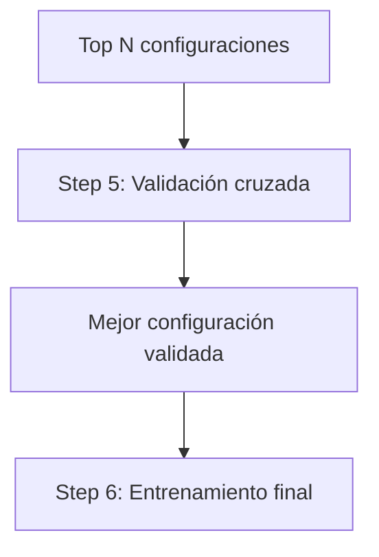
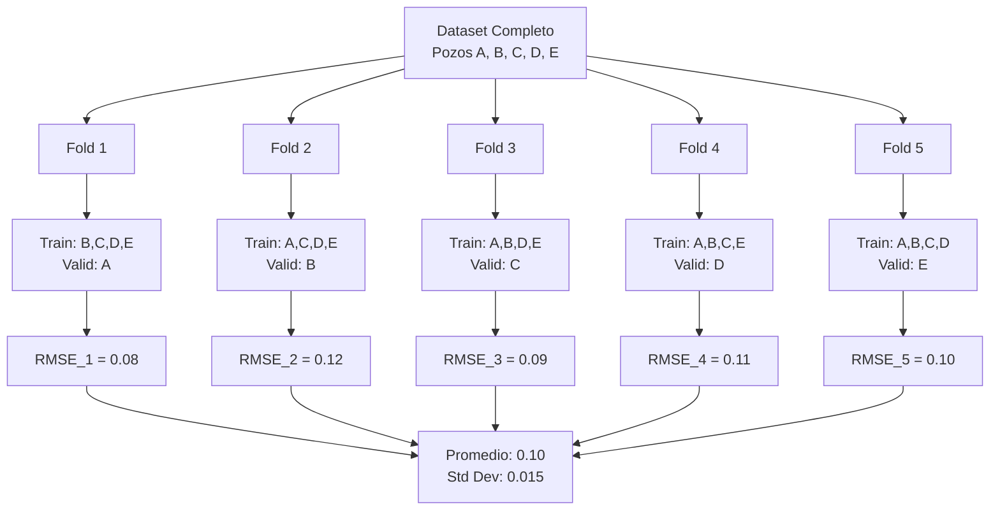
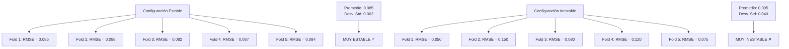
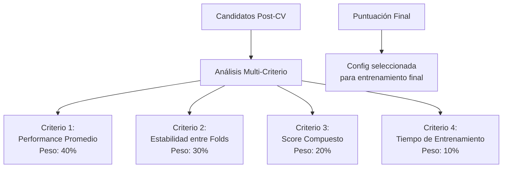

# Step 5: Cross-Validation of Top Configs

## Propósito
Este paso implementa la validación cruzada de las configuraciones más prometedoras, correspondiendo exactamente al **Step 5** del pipeline principal. Su función es evaluar exhaustivamente cada configuración candidata para identificar cuál generaliza mejor y es más estable antes del entrenamiento final.

## Descripción del Workflow

**¿Por qué no es suficiente la evaluación del Step 4?**
La optimización de hiperparámetros evaluó configuraciones con entrenamientos rápidos (20 épocas) en una sola división de datos. Esto puede ser engañoso: una configuración podría parecer excelente por casualidad en esa división específica.

**¿Qué problema resuelve la validación cruzada?**
K-Fold Cross-Validation evalúa cada configuración en múltiples divisiones de datos diferentes, proporcionando una estimación más robusta de su capacidad de generalización real.

**¿Cómo detectamos problemas sutiles?**
Además de métricas básicas (RMSE, accuracy), aplicamos métricas compuestas que penalizan:
- Predicciones con poca variabilidad (modelos "planos")
- Sobreconfianza injustificada en clasificación
- Inestabilidad entre diferentes folds

**Secuencia de operaciones:**
1. Tomar las top-N configuraciones del Step 4
2. Evaluar cada configuración usando K-Fold Cross-Validation
3. Calcular métricas compuestas para cada fold
4. Seleccionar la configuración más robusta y estable



## Entradas y Salidas
- **Entradas**:
  - Configuraciones seleccionadas por Optuna
  - Datos normalizados
  - Definición de la tarea (regresión, clasificación, ambas)
- **Salidas**:
  - Configuración más robusta y estable
  - Reporte de métricas promedio y dispersión (ej: media y desviación estándar)

## Fundamentos Técnicos

### ¿Por qué Validación Cruzada K-Fold?

En petrofísica, nunca confiaríamos en el análisis de un solo núcleo o registro para caracterizar todo un yacimiento. De manera similar, **K-Fold Cross-Validation** evalúa cada configuración de red neuronal en múltiples "muestras" de los datos, asegurando que el rendimiento sea consistente y no producto del azar.

**¿Cómo funciona?**
- Los datos se dividen en K particiones (típicamente 5-10)
- Cada configuración se entrena K veces, usando particiones diferentes como validación
- Como hacer análisis petrofísicos en múltiples intervalos del mismo pozo para validar consistencia

### Métricas Compuestas y Control de Calidad

**Más allá de la Precisión Básica:**
No basta con que un modelo tenga bajo error. En petrofísica necesitamos modelos que:
- **Eviten predicciones planas**: Un modelo que siempre predice el valor promedio puede tener error bajo pero es inútil (como decir que toda la porosidad es 15%)
- **Mantengan confianza apropiada**: No deben ser excesivamente seguros en predicciones incierta

**Sistema de Puntuación Compuesta:**
- **Métrica Principal**: Error de regresión o precisión de clasificación
- **Penalizaciones**: Por falta de diversidad en predicciones o sobreconfianza injustificada
- **Score Final**: Combina precisión + robustez + confiabilidad, como evaluar un yacimiento por reservas + productividad + riesgo

### Selección Robusta del Mejor Modelo

**Criterios de Selección:**
- **Mejor performance promedio**: Consistente a través de múltiples particiones
- **Menor dispersión**: Resultados estables, no erráticos
- **Balance**: Como elegir un yacimiento por sus reservas probadas vs. posibles

**Garantía de Estabilidad:**
Se elige la configuración que no solo funciona bien, sino que funciona **consistentemente** bien, minimizando el riesgo de fallas en producción.

### K-Fold Cross-Validation Explicado Paso a Paso

**¿Cómo funciona exactamente K-Fold?**

Imaginemos que tenemos registros de 5 pozos y queremos usar K=5 (cada pozo como validación una vez):



**¿Por qué K-Fold es más robusto que hold-out validation?**

Consideremos el problema con validación tradicional:

```
Validación Hold-out estándar:
- 80% datos para entrenamiento
- 20% datos para validación
- Problema: ¿Qué pasa si esa división específica no es representativa?

K-Fold Cross-Validation (K=5):
- Fold 1: Entrenar en 80% (particiones B,C,D,E) → Validar en 20% (partición A)
- Fold 2: Entrenar en 80% (particiones A,C,D,E) → Validar en 20% (partición B)
- Fold 3: Entrenar en 80% (particiones A,B,D,E) → Validar en 20% (partición C)
- Fold 4: Entrenar en 80% (particiones A,B,C,E) → Validar en 20% (partición D)
- Fold 5: Entrenar en 80% (particiones A,B,C,D) → Validar en 20% (partición E)

Resultado: Estimación robusta basada en múltiples evaluaciones independientes
```

### Métricas Compuestas: Más Allá del Error Básico

#### El Problema de las Predicciones "Planas"

**¿Qué son las predicciones planas?**

Un modelo puede tener bajo error simplemente prediciendo siempre el valor promedio. Esto es problemático porque aunque el error parezca bajo, el modelo no proporciona información útil:

```mermaid
graph LR
    A[Porosidad Real del Pozo] --> B[5%, 8%, 15%, 25%, 30%, 18%, 12%, 6%]
    C[Modelo "Flato"] --> D[15%, 15%, 15%, 15%, 15%, 15%, 15%, 15%]
    E[Modelo Inteligente] --> F[6%, 9%, 14%, 24%, 29%, 17%, 13%, 7%]
    
    G[Errores Modelo Plano] --> H[10%, 7%, 0%, 10%, 15%, 3%, 3%, 9%]
    I[Errores Modelo Inteligente] --> J[1%, 1%, 1%, 1%, 1%, 1%, 1%, 1%]
    
    H --> K[RMSE = 7.5%]
    J --> L[RMSE = 1.0%]
    
    M[¿Cuál es mejor?] --> N[¡El inteligente obviamente!<br/>Pero necesitamos detectar<br/>automáticamente el plano]
```

**Detección Automática de Predicciones Planas:**

```
Cálculo de Penalización por Predicciones Planas:

1. Calcular varianza de las predicciones
2. Calcular varianza de los valores reales
3. Ratio de varianzas = Var(predicciones) / Var(reales)

Interpretación:
- Ratio ≈ 1.0: Modelo captura toda la variabilidad (BUENO)
- Ratio ≈ 0.5: Modelo captura 50% de variabilidad (REGULAR)  
- Ratio ≈ 0.1: Modelo hace predicciones muy planas (MALO)

Penalización = (1 - ratio) * factor_penalización
```

#### El Problema de la Sobreconfianza

**¿Qué es sobreconfianza en clasificación?**

Un modelo sobreconfiado asigna probabilidades extremas (99% o 1%) cuando debería ser más cauteloso:

```
Ejemplo de Clasificación Litológica:

Caso Real: Arenisca con algunas características de lutita
Probabilidades apropiadas: [Arenisca: 70%, Lutita: 25%, Caliza: 5%]

Modelo Sobreconfiado:
Probabilidades problemáticas: [Arenisca: 99%, Lutita: 1%, Caliza: 0%]

¿Por qué es malo?
- Ignora la incertidumbre geológica real
- No comunica riesgo apropiadamente  
- Decisiones erróneas por exceso de confianza
```

**Medición de Sobreconfianza: Entropía**

```mermaid
graph TD
    A[Distribución de Probabilidades] --> B[Calcular Entropía]
    
    C[Caso 1: Equilibrado<br/>[33%, 33%, 34%]] --> D[Entropía Alta ≈ 1.1<br/>Buena incertidumbre]
    
    E[Caso 2: Confiado<br/>[70%, 20%, 10%]] --> F[Entropía Media ≈ 0.8<br/>Confianza apropiada]
    
    G[Caso 3: Sobreconfiado<br/>[99%, 1%, 0%]] --> H[Entropía Baja ≈ 0.1<br/>Sobreconfianza problemática]
    
    I[Sistema de Penalización] --> J[Penalizar entropía muy baja<br/>Premiar entropía apropiada]
```

#### Cálculo del Score Compuesto

**Fórmula General:**

```
Score_Compuesto = Métrica_Principal + Σ(Penalizaciones)

Para Regresión:
Score = RMSE + Penalización_Flatness + Penalización_Outliers

Para Clasificación:  
Score = (1 - Accuracy) + Penalización_Overconfidence + Penalización_Imbalance

Objetivo: MINIMIZAR el score compuesto
```

**Ejemplo Numérico para Regresión:**

```
Configuración A:
- RMSE = 0.08
- Flatness penalty = 0.02 (predicciones algo planas)
- Outlier penalty = 0.01 (pocos outliers extremos)
- Score total = 0.08 + 0.02 + 0.01 = 0.11

Configuración B:  
- RMSE = 0.09  
- Flatness penalty = 0.00 (buena variabilidad)
- Outlier penalty = 0.005 (muy pocos outliers)
- Score total = 0.09 + 0.00 + 0.005 = 0.095

¡Configuración B gana! Aunque tiene mayor RMSE,
es más confiable por no hacer predicciones planas.
```

### Análisis de Estabilidad Entre Folds

#### ¿Qué es Estabilidad?

Un buen modelo debe funcionar **consistentemente** en diferentes subconjuntos de datos:



**¿Por qué la Estabilidad es Crucial en Petrofísica?**

```
En un campo petrolero, queremos modelos que funcionen:
- En pozos de desarrollo (conocidos) 
- En pozos exploratorios (desconocidos)
- En diferentes facies geológicas
- En diferentes calidades de datos

Un modelo inestable puede:
- Funcionar perfectamente en pozo piloto
- Fallar catastróficamente en pozo de desarrollo
- Generar interpretaciones erróneas
- Causar decisiones de perforación costosas
```

#### Métricas de Estabilidad

**1. Coeficiente de Variación:**
```
CV = Desviación_Estándar / Promedio

Ejemplo:
Config A: Promedio=0.085, Std=0.002 → CV = 0.024 (2.4% variación)
Config B: Promedio=0.095, Std=0.040 → CV = 0.421 (42% variación!)

Interpretación:
CV < 0.05: Muy estable
CV < 0.10: Estable  
CV < 0.20: Moderadamente estable
CV > 0.20: Inestable
```

**2. Rango Intercuartílico (IQR):**
```
Para 5 folds ordenados: Q1 (25%), Q2 (50%), Q3 (75%)

Config A: [0.082, 0.084, 0.085, 0.087, 0.088]
- Q1 = 0.084, Q3 = 0.087
- IQR = 0.087 - 0.084 = 0.003

Config B: [0.050, 0.075, 0.080, 0.120, 0.150]  
- Q1 = 0.075, Q3 = 0.120
- IQR = 0.120 - 0.075 = 0.045

¡15x más variable!
```

### Selección del Modelo Más Robusto

#### Criterio Multi-Objetivo

La selección final considera múltiples factores:



**Ejemplo de Selección Final:**

```
Configuración A:
- RMSE promedio: 0.085 (Ranking: #2)
- Estabilidad (CV): 0.024 (Ranking: #1 - Muy estable)
- Score compuesto: 0.092 (Ranking: #1)
- Tiempo: 45 min (Ranking: #2)
- Puntuación ponderada: (0.085×0.4) + (0.024×0.3) + (0.092×0.2) + (45×0.1) = 0.129

Configuración B:
- RMSE promedio: 0.080 (Ranking: #1)  
- Estabilidad (CV): 0.095 (Ranking: #3 - Inestable)
- Score compuesto: 0.105 (Ranking: #3)
- Tiempo: 38 min (Ranking: #1)
- Puntuación ponderada: (0.080×0.4) + (0.095×0.3) + (0.105×0.2) + (38×0.1) = 0.142

¡Configuración A gana! Aunque B tiene mejor RMSE,
A es mucho más estable y confiable.
```

#### Documentación de la Selección

Para cada configuración evaluada se registra:

```
Reporte de Cross-Validation - Configuración Seleccionada:

Arquitectura: 3 capas, 142 neuronas, LR=0.0028, Dropout=0.15

Métricas por Fold:
- Fold 1: RMSE=0.083, Score=0.089, Tiempo=44min  
- Fold 2: RMSE=0.087, Score=0.094, Tiempo=46min
- Fold 3: RMSE=0.085, Score=0.091, Tiempo=43min
- Fold 4: RMSE=0.088, Score=0.095, Tiempo=45min
- Fold 5: RMSE=0.082, Score=0.088, Tiempo=47min

Estadísticas Consolidadas:
- RMSE: 0.085 ± 0.002 (CV = 2.4%)
- Score Compuesto: 0.091 ± 0.003 (CV = 3.3%)
- Tiempo promedio: 45 ± 1.5 min

Justificación de Selección:
✓ Excelente estabilidad entre folds
✓ Score compuesto balanceado (precisión + diversidad)
✓ Tiempo de entrenamiento razonable
✓ Sin evidencia de overfitting o underfitting
```

## Explicación Matemática (resumida)
- **K-Fold Cross-Validation**: Los datos se dividen en K partes. Cada configuración se entrena K veces, usando una parte distinta como validación en cada ciclo.
- **Métricas compuestas**: Se combinan medidas de desempeño (ej: error, accuracy) con penalizaciones por falta de diversidad o sobreconfianza en las predicciones.

## Referencia de Código
- **Source:** `code/src/neural_network/cross_validate_top_configs.py`
- **Función principal:** `cross_validation()` 