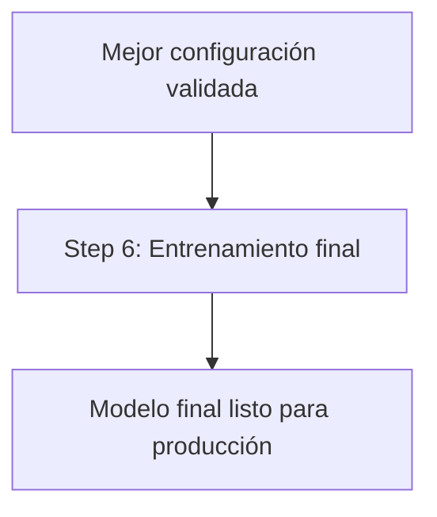
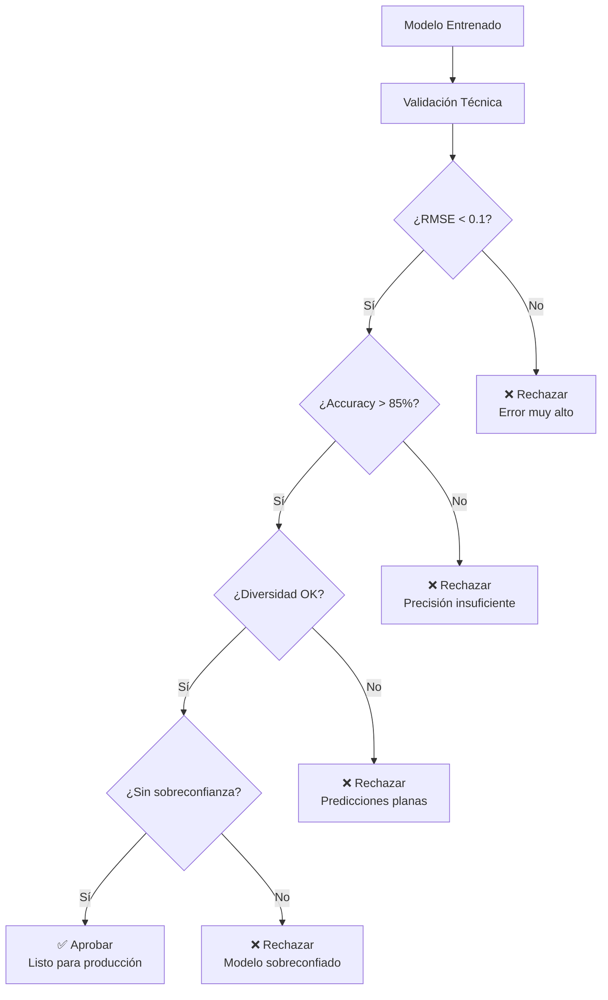
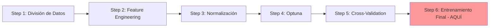
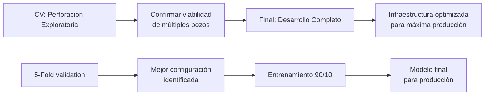
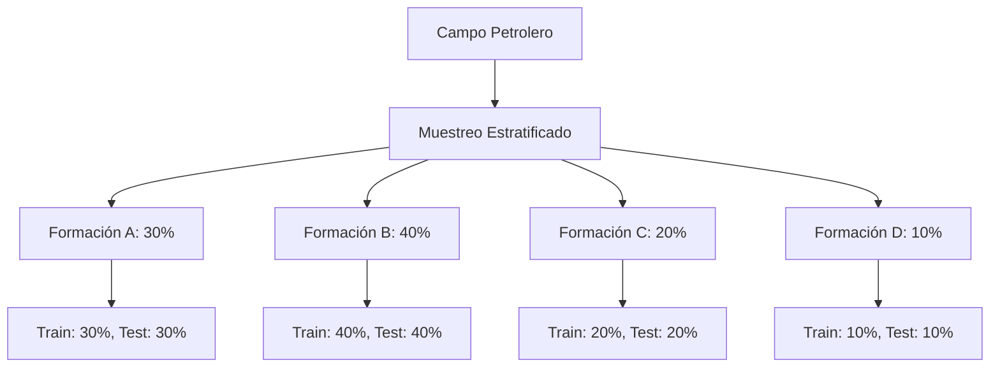
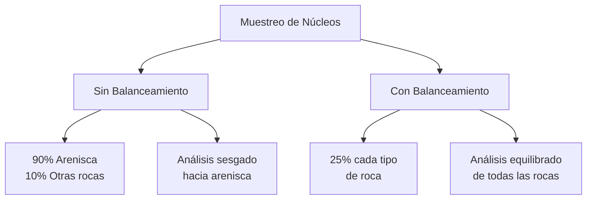

# Step 6: Final Training

## Propósito
Este paso implementa el entrenamiento final del modelo, correspondiendo exactamente al **Step 6** del pipeline principal. Su función es entrenar la configuración óptima seleccionada usando la máxima cantidad de datos disponibles, aplicando técnicas avanzadas de regularización y control de calidad para producir un modelo listo para inferencia en datos nuevos.

## Descripción del Workflow

**¿Por qué un entrenamiento final separado?**
Los pasos anteriores usaron entrenamientos limitados (20 épocas en Step 4) o divisiones múltiples (K-Fold en Step 5) para comparar configuraciones. Ahora que sabemos cuál configuración es óptima, podemos entrenarla completamente con todos los datos disponibles.

**¿Cómo maximizamos el uso de datos?**
Utilizamos una división 90/10 en lugar de la típica 80/20. Esto es posible porque ya validamos la configuración exhaustivamente en el Step 5, reduciendo el riesgo de sobreajuste.

**¿Qué técnicas especiales aplicamos?**
- **Estratificación**: División que mantiene proporciones representativas
- **Balanceo de clases**: Compensación por clases minoritarias importantes
- **Callbacks adaptativos**: Estrategias específicas según el tipo de tarea
- **Control de calidad**: Validación automática de la calidad de predicciones

**Secuencia de operaciones:**
1. División estratificada 90/10 de los datos
2. Aplicación de balanceo de clases cuando es necesario
3. Entrenamiento completo con callbacks adaptativos
4. Evaluación final y análisis de calidad de predicciones



## Entradas y Salidas
- **Entradas**:
  - Configuración óptima seleccionada
  - Datos normalizados
  - Definición de la tarea (regresión, clasificación, ambas)
- **Salidas**:
  - Modelo final entrenado y validado
  - Reporte de métricas finales y análisis de diversidad

## Fundamentos Técnicos

### División Estratificada 90/10: Maximizando el Uso de Datos

**¿Por qué 90% para entrenamiento?**
Como ya validamos exhaustivamente la configuración en el Step 5, podemos usar con confianza una mayor proporción de datos para entrenamiento. Esto maximiza el aprendizaje del modelo mientras mantenemos suficientes datos (10%) para validación final.

**Estratificación para Representatividad:**
- **Para regresión**: Asegura que todos los rangos de valores objetivo estén bien representados en ambas divisiones
- **Para clasificación**: Mantiene la proporción de todas las clases, especialmente las minoritarias
- **Para tareas combinadas**: Aplica estratificación considerando ambos criterios simultáneamente

### Balanceo de Clases: Manejando Clases Minoritarias

**¿Por qué es crítico el balanceo de clases?**
En muchos problemas de clasificación, las clases no están distribuidas uniformemente. Sin balanceo, el modelo tiende a favorecer las clases mayoritarias, ignorando las minoritarias que pueden ser igualmente importantes.

**¿Cómo implementamos el balanceo?**
Se calculan pesos inversamente proporcionales a la frecuencia de cada clase:
- Clases frecuentes reciben peso menor
- Clases raras reciben peso mayor
- El modelo aprende a no ignorar las clases minoritarias importantes

**¿Cuándo aplicamos balanceo?**
Solo cuando el desbalance es significativo y las clases minoritarias son importantes para el problema específico.

### Callbacks de Control de Calidad Automático

**Early Stopping - Prevención de Sobreentrenamiento:**
- Monitorea métricas de validación durante el entrenamiento
- Detiene automáticamente si no hay mejora por un número específico de épocas
- Evita sobreajuste y ahorra recursos computacionales

**Reducción Adaptativa de Learning Rate:**
- Reduce automáticamente la tasa de aprendizaje cuando el progreso se estanca
- Permite ajustes más finos cerca de la convergencia óptima
- Mejora la estabilidad del entrenamiento en etapas avanzadas

**Model Checkpointing:**
- Guarda automáticamente la mejor versión del modelo durante el entrenamiento
- Permite recuperar el estado óptimo incluso si el entrenamiento continúa más allá
- Garantiza que no se pierda el mejor resultado por fallas técnicas

### Evaluación y Documentación Integral

**Análisis de Diversidad de Predicciones:**
- Verifica que el modelo genere predicciones con variabilidad apropiada
- Detecta automáticamente predicciones "planas" o repetitivas
- Valida que el modelo cubra el rango completo de valores objetivo

**Trazabilidad Completa:**
- Registra toda la configuración de hiperparámetros utilizada
- Documenta el historial completo de entrenamiento (métricas por época)
- Permite reproducibilidad completa de los resultados obtenidos

## Explicación Matemática (resumida)
- **División estratificada 90/10**: Se asegura que la distribución de clases o valores objetivo sea representativa tanto en entrenamiento como en validación.
- **Balanceo de clases**: Se ajustan los pesos de las clases para evitar que el modelo favorezca las más frecuentes.
- **Callbacks**: Estrategias automáticas para detener el entrenamiento si no hay mejora, reducir la tasa de aprendizaje, y restaurar los mejores pesos.

### Ejemplo Completo de Entrenamiento Final

Veamos un ejemplo paso a paso de cómo funciona el entrenamiento final en un caso real de petrofísica:

#### Caso de Estudio: Predicción de Porosidad y Litología

**Configuración Seleccionada por Cross-Validation:**
```
Arquitectura: 3 capas densas
- Capa 1: 142 neuronas, activación ReLU, dropout 15%
- Capa 2: 95 neuronas, activación ReLU, dropout 15%  
- Capa 3: 63 neuronas, activación ReLU, dropout 15%
- Salida Regresión: 1 neurona (porosidad), activación lineal
- Salida Clasificación: 4 neuronas (litología), activación softmax

Hiperparámetros:
- Learning rate: 0.0028
- Batch size: 64
- Optimizer: Adam
```

**Paso 1: División Estratificada 90/10**
```
Dataset original: 12,500 registros de 8 pozos

División por cuartiles de porosidad y clases litológicas:
- Q1 (0-8% porosidad): 3,125 registros
  → Train: 2,813, Test: 312
- Q2 (8-15% porosidad): 3,125 registros  
  → Train: 2,813, Test: 312
- Q3 (15-22% porosidad): 3,125 registros
  → Train: 2,813, Test: 312  
- Q4 (22%+ porosidad): 3,125 registros
  → Train: 2,813, Test: 312

Distribución litológica mantenida:
- Arenisca: 45% en ambos conjuntos
- Lutita: 35% en ambos conjuntos
- Caliza: 15% en ambos conjuntos
- Dolomita: 5% en ambos conjuntos
```

**Paso 2: Análisis de Desbalance y Balanceo**
```
Conteo de clases en entrenamiento:
- Arenisca: 5,063 muestras (peso = 1.0)
- Lutita: 3,938 muestras (peso = 1.3) 
- Caliza: 1,688 muestras (peso = 3.0)
- Dolomita: 563 muestras (peso = 9.0)

Pesos aplicados:
Se penaliza más el error en clases minoritarias
(dolomita 9x más importante que arenisca)
```

**Paso 3: Configuración de Callbacks Adaptativos**
```
Para tareas combinadas (regresión + clasificación):

1. EarlyStopping combinado:
   - Monitor: promedio de RMSE y (1-accuracy)
   - Paciencia: 20 épocas sin mejora
   - Restaurar mejores pesos: Sí

2. ReduceLROnPlateau combinado:
   - Monitor: misma métrica combinada
   - Factor reducción: 0.5
   - Paciencia: 12 épocas
   - Learning rate mínimo: 1e-7

3. ModelCheckpoint:
   - Guardar solo si mejora métrica combinada
   - Sobrescribir versiones anteriores
```

**Paso 4: Monitoreo Durante Entrenamiento**
```
Época 1:   LR=0.0028, RMSE=0.245, Acc=68%, Score=0.327 ← Línea base
Época 5:   LR=0.0028, RMSE=0.156, Acc=78%, Score=0.176 ← Mejora rápida
Época 12:  LR=0.0028, RMSE=0.089, Acc=87%, Score=0.089 ← ¡Nuevo mejor!
Época 18:  LR=0.0028, RMSE=0.087, Acc=88%, Score=0.087 ← Pequeña mejora
Época 30:  LR=0.0014, RMSE=0.085, Acc=89%, Score=0.085 ← LR reducido
Época 42:  LR=0.0007, RMSE=0.084, Acc=90%, Score=0.084 ← Convergencia fina
Época 47:  Parada automática por EarlyStopping (sin mejora por 20 épocas)

Modelo final restaurado: Época 42 (mejor performance)
```

**Paso 5: Evaluación Final en Test Set**
```
Métricas en conjunto de test (10% reservado):

Regresión (Porosidad):
- RMSE: 0.086 (equivale a ±0.86% error promedio)
- R²: 0.94 (explica 94% de la variabilidad)
- MAE: 0.058 (error absoluto promedio)

Clasificación (Litología):
- Accuracy global: 89.2%
- Accuracy por clase:
  * Arenisca: 93% (excelente)
  * Lutita: 88% (bueno)
  * Caliza: 84% (aceptable) 
  * Dolomita: 76% (difícil pero razonable)

Matriz de confusión (%)
       Are  Lut  Cal  Dol
Are │  93   5    2    0  │
Lut │   4   88   7    1  │  
Cal │   3    8   84   5  │
Dol │   2    7   15   76 │
```

**Paso 6: Análisis de Diversidad de Predicciones**
```
Análisis de Calidad de Predicciones:

Regresión (Porosidad):
- Varianza predicciones: 0.0234 ✓ Buena diversidad
- Rango predicciones: 2.1% a 28.9% ✓ Rango realista
- Correlación real vs pred: 0.97 ✓ Excelente correlación

Clasificación (Litología):
- Entropía promedio: 0.45 ✓ Confianza apropiada
- % predicciones >95% confianza: 23% ✓ No sobreconfiado
- % predicciones <60% confianza: 8% ✓ Pocas incertidumbres

Veredicto: MODELO SALUDABLE ✓
```

**Paso 7: Guardado y Documentación Completa**
```
Archivos generados en:
/regression/model/final_train/best_model_regression/

1. saved_model.pb (modelo TensorFlow)
2. variables/ (pesos entrenados)
3. model_config.json (configuración completa)
4. training_history.json (curvas de aprendizaje)
5. final_metrics.json (métricas de evaluación)
6. diversity_analysis.json (análisis de calidad)
7. validation_report.txt (informe final)

Tiempo total de entrenamiento: 1.2 horas
Modelo listo para predicciones en pozos nuevos
```

### Diferencias con Entrenamiento de Desarrollo vs Producción

**Entrenamiento de Desarrollo (Steps 4-5):**
```
Objetivo: Encontrar la mejor configuración
Características:
- Entrenamientos cortos (20 épocas)
- Divisiones múltiples (K-Fold)
- Énfasis en comparación entre modelos
- Se descartan modelos después de evaluación
- Optimización para velocidad de exploración
```

**Entrenamiento de Producción (Step 6):**
```
Objetivo: Crear modelo definitivo para uso real
Características:
- Entrenamiento completo (hasta convergencia)
- División única optimizada (90/10)
- Énfasis en calidad y robustez final
- Se guarda todo para trazabilidad
- Optimización para performance final
```

### Validación de Calidad Pre-Producción

Antes de usar el modelo en pozos reales, se ejecutan validaciones automáticas:



**Criterios de Aceptación por Disciplina:**

```
Petrofísica - Umbrales de Calidad:

Porosidad:
- RMSE < 2% → Excelente (precisión de laboratorio)
- RMSE < 5% → Bueno (decisiones confiables)
- RMSE > 10% → Inaceptable

Permeabilidad:
- Error relativo < 50% → Excelente  
- Error relativo < 100% → Aceptable
- Error relativo > 200% → Inaceptable

Litología:
- Accuracy > 90% → Excelente
- Accuracy > 80% → Bueno
- Accuracy < 70% → Inaceptable

Saturación de Agua:
- Error absoluto < 10% → Excelente
- Error absoluto < 20% → Aceptable  
- Error absoluto > 30% → Inaceptable
```

## Referencia de Código
- **Source:** `code/src/neural_network/final_train.py`
- **Función principal:** `final_train()`

## Contexto en el Pipeline

### ¿Dónde Estamos en el Proceso?


**Entrada**: La mejor configuración validada por Cross-Validation
**Objetivo**: Entrenar el modelo final para producción
**Salida**: Modelo listo para hacer predicciones en pozos nuevos

### Analogía con Desarrollo Petrolero
Es como la **fase de desarrollo del campo**:
- **Entrada**: El prospecto más prometedor confirmado por perforación exploratoria
- **Método**: Desarrollo completo del campo con infraestructura de producción
- **Objetivo**: Maximizar la producción y rentabilidad
- **Resultado**: Campo en producción comercial

---

## ¿Por Qué Entrenamiento Final Separado?

### Diferencias con Cross-Validation
```python
# Cross-Validation (Step 5) - Para SELECCIONAR
objetivo = "comparar configuraciones"
datos = "múltiples divisiones K-Fold"
uso = "validación interna"
resultado = "mejor configuración"

# Entrenamiento Final (Step 6) - Para PRODUCIR
objetivo = "modelo para producción"
datos = "división única 90/10 optimizada"
uso = "predicciones reales"
resultado = "modelo final"
```

### División 90/10 vs K-Fold
```python
# ¿Por qué 90/10 en lugar de 80/20?
train_size = 0.9  # Máximo aprovechamiento de datos
test_size = 0.1   # Suficiente para evaluación final

# Ventajas de 90/10:
# 1. Más datos para entrenar = mejor modelo
# 2. Menos datos para test = más eficiente
# 3. Configuración ya validada = test solo confirma
```

### Analogía con Desarrollo de Campo


---

## División Estratificada de Datos

### Implementación de la División
```python
def create_final_train_test_split(X, y, test_size=0.1, random_state=42):
    """
    Crea división estratificada 90/10 para entrenamiento final.
    
    Estratificación:
    - Para regresión: Por cuartiles de la variable objetivo
    - Para clasificación: Por distribución de clases
    - Para ambas: Combinación de ambos criterios
    """
    if train_task == 'regression':
        # Estratificar por cuartiles de regresión
        y_reg = y[:, 0]  # Primera columna = regresión
        y_stratify = pd.qcut(y_reg, q=4, labels=False, duplicates='drop')
        
    elif train_task == 'classification':
        # Estratificar por clases
        y_cls = y[:, 1]  # Segunda columna = clasificación
        y_stratify = y_cls
        
    elif train_task == 'both':
        # Estratificar por combinación
        y_reg = y[:, 0]
        y_cls = y[:, 1]
        
        # Crear grupos combinados
        reg_quartiles = pd.qcut(y_reg, q=4, labels=False, duplicates='drop')
        combined_groups = reg_quartiles * 10 + y_cls  # Combinación única
        y_stratify = combined_groups
    
    # División estratificada
    X_train, X_test, y_train, y_test = train_test_split(
        X, y,
        test_size=test_size,
        random_state=random_state,
        stratify=y_stratify
    )
    
    return X_train, X_test, y_train, y_test
```

### ¿Por Qué Estratificación?
```python
# Sin estratificación (división aleatoria):
train_classes = [30%, 40%, 20%, 10%]  # Distribución en entrenamiento
test_classes = [10%, 60%, 25%, 5%]    # Distribución en test - DIFERENTE

# Con estratificación:
train_classes = [30%, 40%, 20%, 10%]  # Distribución en entrenamiento
test_classes = [30%, 40%, 20%, 10%]   # Distribución en test - IGUAL
```

### Analogía con Muestreo Geológico


---

## Callbacks Adaptativos por Tarea

### Sistema de Callbacks Inteligente
```python
def get_task_specific_callbacks(train_task, model_save_path):
    """
    Callbacks optimizados según el tipo de tarea.
    
    Diferentes tareas requieren diferentes estrategias:
    - Regresión: Enfoque en convergencia suave
    - Clasificación: Enfoque en estabilidad de clases
    - Ambas: Balance entre ambos objetivos
    """
    callbacks = []
    
    if train_task == 'regression':
        # Callbacks para regresión
        callbacks.extend([
            EarlyStopping(
                monitor='val_regression_output_rmse',
                patience=25,                    # Paciencia alta para convergencia
                verbose=1,
                restore_best_weights=True
            ),
            ReduceLROnPlateau(
                monitor='val_regression_output_rmse',
                factor=0.7,                     # Reducción gradual
                patience=15,                    # Paciencia moderada
                min_lr=1e-7,
                verbose=1
            )
        ])
        
    elif train_task == 'classification':
        # Callbacks para clasificación
        callbacks.extend([
            EarlyStopping(
                monitor='val_classification_output_masked_sparse_acc',
                mode='max',                     # Maximizar accuracy
                patience=20,
                verbose=1,
                restore_best_weights=True
            ),
            ReduceLROnPlateau(
                monitor='val_classification_output_masked_sparse_acc',
                mode='max',
                factor=0.5,                     # Reducción más agresiva
                patience=10,
                min_lr=1e-7,
                verbose=1
            )
        ])
        
    elif train_task == 'both':
        # Callbacks para tareas combinadas
        callbacks.extend([
            EarlyStopping(
                monitor='val_loss',             # Loss combinado
                patience=30,                    # Máxima paciencia
                verbose=1,
                restore_best_weights=True
            ),
            ReduceLROnPlateau(
                monitor='val_loss',
                factor=0.6,                     # Balance entre gradual y agresivo
                patience=12,
                min_lr=1e-7,
                verbose=1
            )
        ])
    
    # Callback común: Guardar mejor modelo
    callbacks.append(
        ModelCheckpoint(
            filepath=model_save_path,
            monitor='val_loss',
            save_best_only=True,
            verbose=1
        )
    )
    
    return callbacks
```

### Justificación de Parámetros

#### Regresión
- **Patience alta (25)**: Convergencia puede ser lenta y ruidosa
- **Factor gradual (0.7)**: Evitar saltos bruscos en learning rate
- **Paciencia LR moderada (15)**: Balance entre adaptación y estabilidad

#### Clasificación
- **Patience moderada (20)**: Convergencia más rápida que regresión
- **Factor agresivo (0.5)**: Accuracy puede beneficiarse de ajustes rápidos
- **Paciencia LR baja (10)**: Respuesta rápida a estancamiento

#### Ambas Tareas
- **Patience máxima (30)**: Dos objetivos requieren más tiempo
- **Factor balanceado (0.6)**: Compromiso entre ambas estrategias
- **Paciencia LR media (12)**: Balance entre regresión y clasificación

---

## Balanceamiento de Clases

### ¿Cuándo Aplicar Balanceamiento?
```python
def should_apply_class_balancing(y_classification, train_task):
    """
    Determina si aplicar balanceamiento de clases.
    
    Criterios:
    1. Solo para tareas con clasificación
    2. Solo si hay desbalance significativo
    3. Suficientes muestras en clase minoritaria
    """
    if train_task == 'regression':
        return False, None
    
    # Contar clases
    unique_classes, class_counts = np.unique(y_classification, return_counts=True)
    
    # Calcular ratio de desbalance
    max_count = np.max(class_counts)
    min_count = np.min(class_counts)
    imbalance_ratio = max_count / min_count
    
    # Criterios para balanceamiento
    significant_imbalance = imbalance_ratio > 2.0  # Más de 2:1
    sufficient_samples = min_count >= 10           # Al menos 10 muestras
    
    if significant_imbalance and sufficient_samples:
        # Calcular pesos balanceados
        class_weights = compute_class_weight(
            'balanced',
            classes=unique_classes,
            y=y_classification
        )
        class_weight_dict = dict(zip(unique_classes, class_weights))
        return True, class_weight_dict
    
    return False, None
```

### Ejemplo de Balanceamiento
```python
# Distribución desbalanceada típica en datos petroleros
class_distribution = {
    0: 1200,  # Arenisca (mayoría)
    1: 800,   # Lutita
    2: 300,   # Caliza
    3: 100    # Dolomita (minoría)
}

# Pesos calculados automáticamente
class_weights = {
    0: 0.52,  # Peso menor para clase mayoritaria
    1: 0.78,  # Peso moderado
    2: 2.08,  # Peso alto
    3: 6.25   # Peso máximo para clase minoritaria
}

# Efecto en entrenamiento
# Sin balanceamiento: Modelo predice siempre arenisca (clase 0)
# Con balanceamiento: Modelo aprende a distinguir todas las clases
```

### Analogía con Muestreo de Núcleos


---

## Entrenamiento Final

### Implementación Completa
```python
def final_train_model(X, y, best_config, unknown_index, 
                     classification_output_shape, train_task, save_path):
    """
    Entrena el modelo final para producción.
    
    Proceso:
    1. División estratificada 90/10
    2. Aplicar balanceamiento si necesario
    3. Construir modelo con mejor configuración
    4. Entrenar con callbacks adaptativos
    5. Evaluar y guardar modelo final
    """
    print("🎯 Starting final model training...")
    
    # ----
    # Step 6.1 – División estratificada de datos
    # ----
    X_train, X_test, y_train, y_test = create_final_train_test_split(
        X, y, test_size=0.1, random_state=42
    )
    
    print(f"📊 Data split: {len(X_train)} train, {len(X_test)} test")
    
    # ----
    # Step 6.2 – Balanceamiento de clases (si necesario)
    # ----
    class_weights = None
    if train_task in ['classification', 'both']:
        y_cls_col = 1 if train_task == 'both' else 0
        should_balance, class_weights = should_apply_class_balancing(
            y_train[:, y_cls_col], train_task
        )
        
        if should_balance:
            print(f"⚖️ Applying class balancing: {class_weights}")
        else:
            print("⚖️ No class balancing needed")
    
    # ----
    # Step 6.3 – Construcción del modelo
    # ----
    model = build_model(
        best_config,
        input_shape=X.shape[1:],
        regression_output_shape=1,
        classification_output_shape=classification_output_shape,
        unknown_index=unknown_index,
        train_task=train_task
    )
    
    print(f"🏗️ Model built with config: {best_config['num_layers']} layers")
    
    # ----
    # Step 6.4 – Callbacks adaptativos
    # ----
    model_save_path = os.path.join(save_path, "best_model_regression")
    callbacks = get_task_specific_callbacks(train_task, model_save_path)
    
    print(f"🔧 Callbacks configured for task: {train_task}")
    
    # ----
    # Step 6.5 – Entrenamiento final
    # ----
    print("🚀 Starting training...")
    
    history = model.fit(
        X_train, y_train,
        validation_data=(X_test, y_test),
        epochs=100,                          # Máximo permitido
        batch_size=best_config['batch_size'],
        class_weight=class_weights,          # Balanceamiento si aplica
        callbacks=callbacks,
        verbose=1
    )
    
    # ----
    # Step 6.6 – Evaluación final
    # ----
    print("📊 Evaluating final model...")
    
    final_metrics = model.evaluate(X_test, y_test, verbose=0)
    metric_names = model.metrics_names
    
    print("🎯 Final Model Performance:")
    for name, value in zip(metric_names, final_metrics):
        print(f"   {name}: {value:.6f}")
    
    # ----
    # Step 6.7 – Análisis de diversidad de predicciones
    # ----
    test_predictions = model.predict(X_test, verbose=0)
    diversity_analysis = analyze_prediction_diversity(test_predictions, train_task)
    
    print("🔍 Prediction Diversity Analysis:")
    for key, value in diversity_analysis.items():
        print(f"   {key}: {value:.6f}")
    
    return model, history, final_metrics, diversity_analysis
```

### Monitoreo Durante Entrenamiento
```python
# Salida típica durante entrenamiento
Epoch 1/100
 - loss: 0.8234 - val_loss: 0.7456 - lr: 0.001
Epoch 10/100
 - loss: 0.4521 - val_loss: 0.4892 - lr: 0.001
Epoch 25/100
 - loss: 0.3456 - val_loss: 0.3789 - lr: 0.001
Epoch 35/100
 - loss: 0.3234 - val_loss: 0.3456 - lr: 0.0007  # LR reducido
Epoch 50/100
 - loss: 0.3123 - val_loss: 0.3234 - lr: 0.0007
Epoch 65/100
 - loss: 0.3089 - val_loss: 0.3198 - lr: 0.0005  # LR reducido otra vez
Epoch 75/100
 - Early stopping triggered - no improvement for 25 epochs
 - Restoring best weights from epoch 50
```

---

## Análisis de Diversidad de Predicciones

### ¿Por Qué Analizar Diversidad?
```python
# Problema: Modelo que predice siempre lo mismo
predictions_bad = [0.5, 0.5, 0.5, 0.5, 0.5]  # Sin diversidad
# Aunque tenga buen RMSE, no es útil para exploración

# Modelo saludable: Predicciones diversas
predictions_good = [0.2, 0.8, 0.4, 0.9, 0.1]  # Con diversidad
# Responde a diferentes características geológicas
```

### Implementación del Análisis
```python
def analyze_prediction_diversity(predictions, train_task):
    """
    Analiza la diversidad de predicciones del modelo final.
    
    Métricas:
    - Varianza: ¿Qué tan diversas son las predicciones?
    - Rango: ¿Cuál es el rango de valores predichos?
    - Entropía: ¿Qué tan confiadas son las predicciones de clasificación?
    """
    analysis = {}
    
    if train_task in ['regression', 'both']:
        # Análisis de regresión
        reg_predictions = predictions[0] if train_task == 'both' else predictions
        reg_predictions = reg_predictions.flatten()
        
        analysis['regression_variance'] = np.var(reg_predictions)
        analysis['regression_std'] = np.std(reg_predictions)
        analysis['regression_range'] = np.max(reg_predictions) - np.min(reg_predictions)
        analysis['regression_mean'] = np.mean(reg_predictions)
        
        # Detección de problemas
        if analysis['regression_variance'] < 1e-6:
            analysis['regression_status'] = 'FLAT_PREDICTIONS'
        elif analysis['regression_variance'] < 1e-3:
            analysis['regression_status'] = 'LOW_DIVERSITY'
        else:
            analysis['regression_status'] = 'HEALTHY'
    
    if train_task in ['classification', 'both']:
        # Análisis de clasificación
        cls_predictions = predictions[1] if train_task == 'both' else predictions
        
        # Calcular entropía promedio
        entropies = []
        for pred in cls_predictions:
            entropy = -np.sum(pred * np.log(pred + 1e-8))  # Evitar log(0)
            entropies.append(entropy)
        
        analysis['classification_entropy_mean'] = np.mean(entropies)
        analysis['classification_entropy_std'] = np.std(entropies)
        
        # Confianza promedio (probabilidad máxima)
        max_probs = np.max(cls_predictions, axis=1)
        analysis['classification_confidence_mean'] = np.mean(max_probs)
        analysis['classification_confidence_std'] = np.std(max_probs)
        
        # Detección de problemas
        if analysis['classification_entropy_mean'] < 0.1:
            analysis['classification_status'] = 'OVERCONFIDENT'
        elif analysis['classification_confidence_mean'] < 0.4:
            analysis['classification_status'] = 'UNDERCONFIDENT'
        else:
            analysis['classification_status'] = 'HEALTHY'
    
    return analysis
```

### Interpretación de Resultados
```python
# Ejemplo de análisis saludable
diversity_analysis = {
    'regression_variance': 0.0234,      # ✅ Buena diversidad
    'regression_range': 0.85,           # ✅ Rango amplio
    'regression_status': 'HEALTHY',     # ✅ Estado saludable
    
    'classification_entropy_mean': 0.67, # ✅ Entropía moderada
    'classification_confidence_mean': 0.72, # ✅ Confianza apropiada
    'classification_status': 'HEALTHY'   # ✅ Estado saludable
}

# Ejemplo de análisis problemático
diversity_analysis_bad = {
    'regression_variance': 1.2e-07,     # ❌ Predicciones planas
    'regression_range': 0.001,          # ❌ Rango muy pequeño
    'regression_status': 'FLAT_PREDICTIONS', # ❌ Problema detectado
    
    'classification_entropy_mean': 0.05, # ❌ Muy sobreconfiado
    'classification_confidence_mean': 0.98, # ❌ Demasiado seguro
    'classification_status': 'OVERCONFIDENT' # ❌ Problema detectado
}
```

---

## Guardado del Modelo Final

### Estructura de Guardado
```python
def save_final_model_complete(model, best_config, history, metrics, 
                             diversity_analysis, save_path):
    """
    Guarda modelo final con toda la información necesaria.
    
    Archivos guardados:
    1. Modelo TensorFlow completo
    2. Configuración de hiperparámetros
    3. Historia de entrenamiento
    4. Métricas finales
    5. Análisis de diversidad
    """
    # Crear directorio
    os.makedirs(save_path, exist_ok=True)
    
    # 1. Modelo TensorFlow
    model_path = os.path.join(save_path, "best_model_regression")
    model.save(model_path)
    print(f"💾 Model saved: {model_path}")
    
    # 2. Configuración
    config_path = os.path.join(save_path, "model_config.json")
    with open(config_path, 'w') as f:
        json.dump(best_config, f, indent=4)
    print(f"📄 Config saved: {config_path}")
    
    # 3. Historia de entrenamiento
    history_path = os.path.join(save_path, "training_history.json")
    history_dict = {key: [float(val) for val in values] 
                   for key, values in history.history.items()}
    with open(history_path, 'w') as f:
        json.dump(history_dict, f, indent=4)
    print(f"📈 History saved: {history_path}")
    
    # 4. Métricas finales
    metrics_path = os.path.join(save_path, "final_metrics.json")
    metrics_dict = dict(zip(model.metrics_names, metrics))
    with open(metrics_path, 'w') as f:
        json.dump(metrics_dict, f, indent=4)
    print(f"📊 Metrics saved: {metrics_path}")
    
    # 5. Análisis de diversidad
    diversity_path = os.path.join(save_path, "diversity_analysis.json")
    with open(diversity_path, 'w') as f:
        json.dump(diversity_analysis, f, indent=4)
    print(f"🔍 Diversity analysis saved: {diversity_path}")
```

### Estructura Final Resultante
```
regression/model/final_train/
├── best_model_regression/          # Modelo TensorFlow completo
│   ├── saved_model.pb
│   ├── variables/
│   │   ├── variables.data-00000-of-00001
│   │   └── variables.index
│   └── assets/
├── model_config.json               # Configuración de hiperparámetros
├── training_history.json           # Historia completa de entrenamiento
├── final_metrics.json              # Métricas de evaluación final
└── diversity_analysis.json         # Análisis de diversidad de predicciones
```

---

## Validación Final del Modelo

### Criterios de Aceptación
```python
def validate_final_model(metrics, diversity_analysis, train_task):
    """
    Valida que el modelo final cumple criterios de calidad.
    
    Criterios por tarea:
    - Regresión: RMSE < umbral, diversidad > mínimo
    - Clasificación: Accuracy > umbral, entropía apropiada
    - Ambas: Ambos criterios deben cumplirse
    """
    validation_results = {'passed': True, 'issues': []}
    
    if train_task in ['regression', 'both']:
        # Validar regresión
        rmse = metrics.get('regression_output_rmse', float('inf'))
        variance = diversity_analysis.get('regression_variance', 0)
        
        if rmse > 0.5:  # Umbral ajustable según proyecto
            validation_results['issues'].append(f"High RMSE: {rmse:.4f}")
            validation_results['passed'] = False
        
        if variance < 1e-6:
            validation_results['issues'].append("Flat regression predictions")
            validation_results['passed'] = False
    
    if train_task in ['classification', 'both']:
        # Validar clasificación
        accuracy = metrics.get('classification_output_masked_sparse_acc', 0)
        entropy = diversity_analysis.get('classification_entropy_mean', 0)
        
        if accuracy < 0.7:  # Umbral ajustable según proyecto
            validation_results['issues'].append(f"Low accuracy: {accuracy:.4f}")
            validation_results['passed'] = False
        
        if entropy < 0.1:
            validation_results['issues'].append("Overconfident predictions")
            validation_results['passed'] = False
    
    return validation_results
```

### Ejemplo de Validación
```python
# Modelo que pasa validación
validation_passed = {
    'passed': True,
    'issues': []
}
print("✅ Model validation PASSED - Ready for production")

# Modelo que falla validación
validation_failed = {
    'passed': False,
    'issues': [
        'High RMSE: 0.6234',
        'Overconfident predictions'
    ]
}
print("❌ Model validation FAILED:")
for issue in validation_failed['issues']:
    print(f"   - {issue}")
```

---

## Configuración en el Proyecto

### Parámetros Principales
```python
# En hyperparameters.py
FINAL_TRAIN_TEST_SIZE = 0.1     # División 90/10
FINAL_TRAIN_MAX_EPOCHS = 100    # Máximo de épocas
FINAL_TRAIN_RANDOM_STATE = 42   # Reproducibilidad

# En final_train.py
class_weight_threshold = 2.0    # Umbral para balanceamiento
min_samples_per_class = 10      # Mínimo para balanceamiento
```

### Integración en Pipeline
```python
# En pipeline.py - Step 6
final_model, history, final_metrics, diversity_analysis = final_train_model(
    X=X_scaled,
    y=y_scaled,
    best_config=best_config,
    unknown_index=unknown_index,
    classification_output_shape=classification_output_shape,
    train_task=train_task,
    save_path=os.path.join(task_base_dir, 'model', 'final_train')
)
```

---

## Fuente del Código

**Archivo principal**: `code/src/neural_network/final_train.py`
- `final_train_model()`: Implementación principal
- `create_final_train_test_split()`: División estratificada
- `get_task_specific_callbacks()`: Callbacks adaptativos
- `analyze_prediction_diversity()`: Análisis de diversidad

**Integración**: `code/src/neural_network/pipeline.py` (líneas 380-420) 