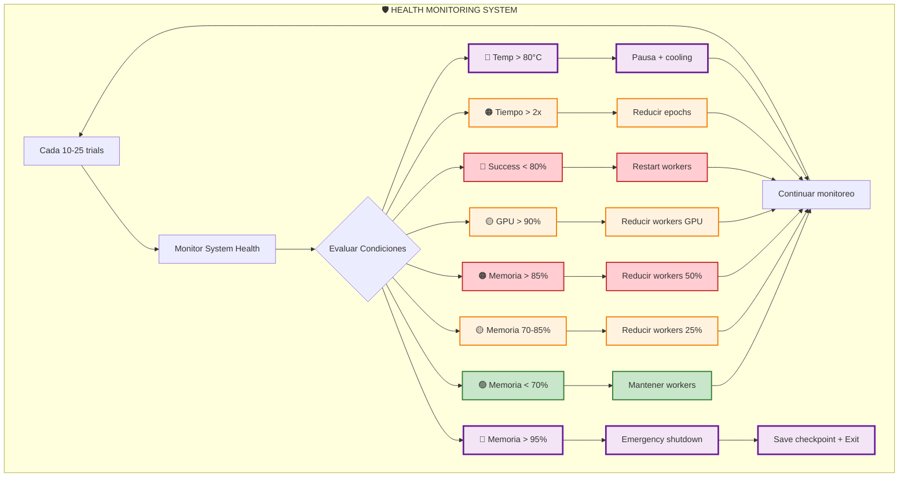
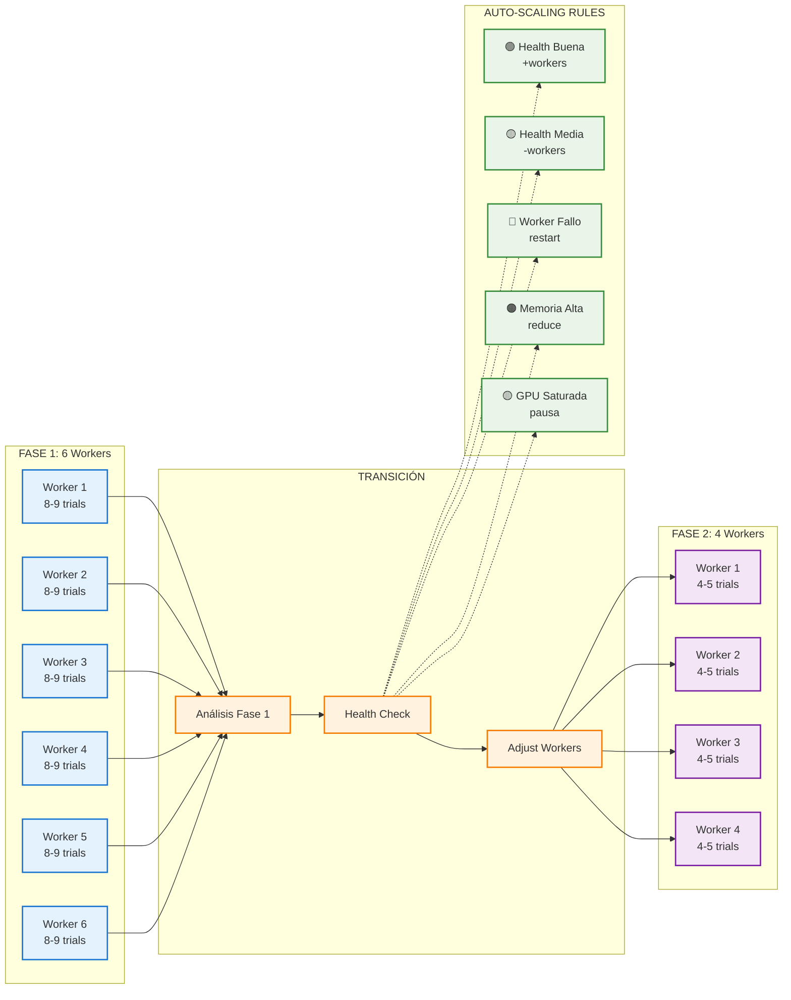
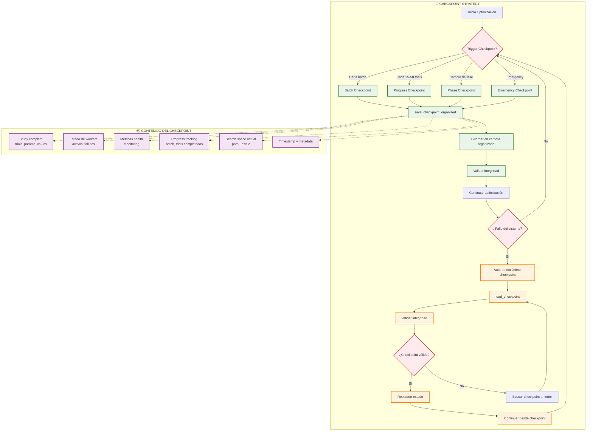
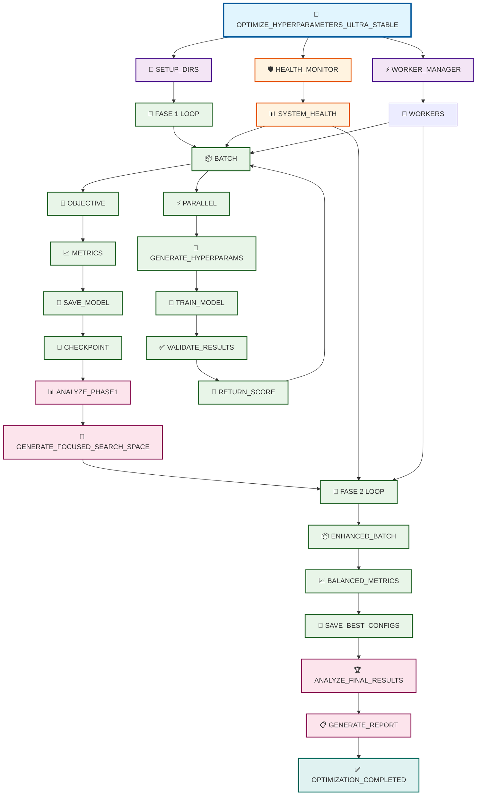
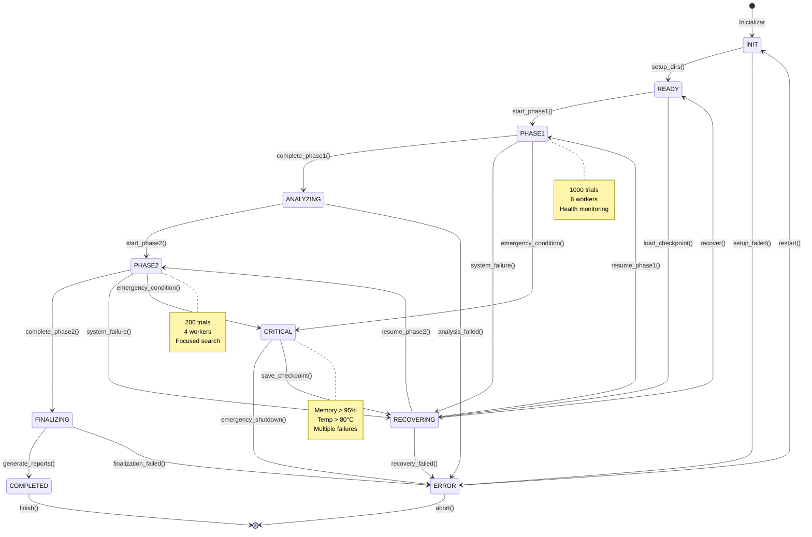

# 📜 CARTA MAGNA DEL OPTIMIZER
## Especificaciones de Funciones para Optimización de Hiperparámetros ULTRA-ESTABLE

---

## 📑 **ÍNDICE**

### **I. FUNDAMENTOS**
1. [🎯 Misión y Principios](#-misión-y-principios)
2. [🏗️ Arquitectura del Sistema](#️-arquitectura-del-sistema)

### **II. ESTRATEGIA ULTRA-ESTABLE**
3. [🚀 Configuración de 2 Fases](#-configuración-de-2-fases)
4. [📊 Métricas por Fase](#-métricas-por-fase)

### **III. DEFINICIONES DE FUNCIONES**
5. [🔧 Funciones Principales](#-funciones-principales)
6. [🛡️ Sistema de Monitoreo](#️-sistema-de-monitoreo)
7. [⚡ Ejecución Paralela](#-ejecución-paralela)
8. [📊 Análisis de Fases](#-análisis-de-fases)
9. [💾 Checkpointing](#-checkpointing)
10. [📈 Cálculo de Métricas](#-cálculo-de-métricas)
11. [🔍 Evaluación de Calidad](#-evaluación-de-calidad)
12. [⚠️ Manejo de Errores](#️-manejo-de-errores)
13. [🔧 Utilidades](#-utilidades)

### **IV. ESPECIFICACIONES TÉCNICAS**
14. [📋 Resumen Ejecutivo](#-resumen-ejecutivo)

---

## 🎯 **MISIÓN Y PRINCIPIOS**

### **Misión:**
Optimizador de hiperparámetros **ULTRA-ESTABLE** capaz de manejar 1000/100/10 trials con paralelización inteligente, health monitoring y 0% crashes del sistema.

### **Principios Fundamentales:**
- **Máximo 300 líneas** en optimizer.py
- **Máximo 50 líneas** por función
- **Máximo 5 parámetros** por función
- **Una función = Una responsabilidad**
- **Fail-fast** con recuperación automática

---

## 🏗️ **ARQUITECTURA DEL SISTEMA**

### **Componentes Principales:**
1. **Optimizer Principal** - Orquestación de 3 fases
2. **Health Monitor** - Monitoreo continuo del sistema
3. **Worker Manager** - Gestión inteligente de paralelización
4. **Phase Analyzer** - Análisis y adaptación entre fases
5. **Checkpoint System** - Recuperación automática ante fallos

### **Flujo de Datos:**
```
Datos → Fase 1 (1000 trials) → Análisis → Fase 2 (200 trials) → Top Configuraciones → Evaluación Externa
```

---

## 🏗️ **SEPARACIÓN DE RESPONSABILIDADES**

### **🎯 Principio Fundamental:**
**`optimizer.py` debe contener ÚNICAMENTE la estrategia de optimización de hiperparámetros.** Todo lo que no esté directamente relacionado con la búsqueda en el espacio de hiperparámetros debe estar en archivos separados en la carpeta `utils/`.

### **📁 Arquitectura de Archivos:**

```
code/src/
├── utils/                          # 🔧 Utilidades generales del proyecto
│   ├── memory_manager.py          # 💾 Gestión de memoria (YA EXISTE)
│   ├── initialize_gpu.py          # 🎮 Inicialización GPU (YA EXISTE)
│   ├── utils.py                   # 🔧 Utilidades generales (YA EXISTE)
│   ├── optimizer_health_monitor.py    # 🛡️ Monitoreo específico del optimizer
│   ├── optimizer_checkpoint_manager.py # 💾 Checkpoints específicos del optimizer
│   ├── optimizer_file_organizer.py    # 📁 Organización de archivos del optimizer
│   ├── optimizer_quality_validator.py # 📊 Validación de calidad del optimizer
│   ├── optimizer_error_handler.py     # ⚠️ Manejo de errores del optimizer
│   └── ...                        # Otras utilidades del proyecto
└── neural_network/
    ├── optimizer.py               # 🎯 CORE: Solo estrategia de optimización
    ├── hyperparameters.py        # 🔧 Espacios de hiperparámetros (YA EXISTE)
    ├── model.py                   # 🤖 Funciones de modelo (YA EXISTE)
    ├── metrics.py                 # 📊 Cálculo de métricas (YA EXISTE)
    └── ...                        # Otros archivos existentes
```

### **🎯 `optimizer.py` - CORE (150-200 líneas):**
**Responsabilidad:** Estrategia pura de optimización de hiperparámetros

| **Función** | **Propósito** |
|-------------|---------------|
| `optimize_hyperparameters_ultra_stable()` | Orquestación principal de 2 fases |
| `objective_function()` | Función objetivo para trials |
| `generate_hyperparams()` | Generación de hiperparámetros |
| `execute_parallel_batch()` | Ejecución paralela de trials |
| `execute_phase2_enhanced_batch()` | Batch enfocado Fase 2 |
| `analyze_phase1_results_massive()` | Análisis de resultados Fase 1 |
| `generate_focused_search_space()` | Generación de espacio enfocado |
| `analyze_phase2_final_results()` | Análisis final Fase 2 |
| `get_best_configurations_dict()` | Extracción de mejores configs |

### **🛡️ `utils/optimizer_health_monitor.py` (~80 líneas):**
**Responsabilidad:** Monitoreo de salud específico del optimizer

| **Clase/Función** | **Propósito** |
|-------------------|---------------|
| `OptimizerHealthMonitor` | Monitoreo continuo específico del optimizer |
| `OptimizerWorkerManager` | Gestión inteligente de workers del optimizer |
| `monitor_optimizer_memory()` | Monitoreo específico del optimizer |
| `enforce_optimizer_limits()` | Límites específicos del optimizer |

### **💾 `utils/optimizer_checkpoint_manager.py` (~60 líneas):**
**Responsabilidad:** Gestión de checkpoints específicos del optimizer

| **Función** | **Propósito** |
|-------------|---------------|
| `save_optimizer_checkpoint()` | Guardado organizado de checkpoints del optimizer |
| `load_optimizer_checkpoint()` | Carga de checkpoints del optimizer |
| `cleanup_optimizer_batches()` | Limpieza entre batches del optimizer |
| `optimizer_system_cleanup()` | Limpieza específica del optimizer |

### **📁 `utils/optimizer_file_organizer.py` (~70 líneas):**
**Responsabilidad:** Organización de archivos específicos del optimizer

| **Función** | **Propósito** |
|-------------|---------------|
| `setup_optimizer_directories()` | Creación de estructura del optimizer |
| `generate_optimizer_timestamp()` | Timestamps específicos del optimizer |
| `save_optimizer_model_metadata()` | Guardado con metadata del optimizer |
| `cleanup_optimizer_runs()` | Limpieza de ejecuciones del optimizer |

### **📊 `utils/optimizer_quality_validator.py` (~50 líneas):**
**Responsabilidad:** Validación de calidad específica del optimizer

| **Función** | **Propósito** |
|-------------|---------------|
| `validate_optimizer_quality()` | Validación específica del optimizer |
| `check_optimizer_variance()` | Verificación de varianza del optimizer |
| `assess_optimizer_promise()` | Evaluación de promesa del optimizer |
| `is_optimizer_trial_valuable()` | Determinación de valor del trial |

### **⚠️ `utils/optimizer_error_handler.py` (~40 líneas):**
**Responsabilidad:** Manejo de errores específicos del optimizer

| **Función** | **Propósito** |
|-------------|---------------|
| `handle_optimizer_failures()` | Manejo de fallos específicos del optimizer |
| `optimizer_emergency_shutdown()` | Parada de emergencia del optimizer |
| `validate_optimizer_results()` | Validación de resultados del optimizer |

### **🔗 Imports en `optimizer.py`:**
```python
# Imports de utilidades generales del proyecto (incluyendo utilidades del optimizer)
from utils.optimizer_health_monitor import OptimizerHealthMonitor, OptimizerWorkerManager
from utils.optimizer_checkpoint_manager import save_optimizer_checkpoint, load_optimizer_checkpoint
from utils.optimizer_file_organizer import setup_optimizer_directories, generate_optimizer_timestamp
from utils.optimizer_quality_validator import validate_optimizer_quality, is_optimizer_trial_valuable
from utils.optimizer_error_handler import handle_optimizer_failures, validate_optimizer_results
from utils.memory_manager import MemoryManager
from utils.initialize_gpu import initialize_gpu
from utils.utils import setup_logging

# Imports del proyecto neural_network (YA EXISTENTES)
from hyperparameters import get_hyperparameter_space
from model import create_model, train_model
from metrics import calculate_phase1_metrics, calculate_phase2_metrics
```

### **📏 Límites de Código:**
- **`optimizer.py`**: Máximo 200 líneas
- **Cada archivo utils/optimizer_*.py**: Máximo 100 líneas
- **Cada función**: Máximo 50 líneas
- **Total específico del optimizer**: ~500 líneas distribuidas
- **Reutilizar utilidades existentes**: `utils/memory_manager.py`, `utils/initialize_gpu.py`, etc.

### **✅ Beneficios de esta Separación:**
1. **🎯 Claridad:** `optimizer.py` es puro y enfocado
2. **🔄 Reutilización:** Todas las utilidades están centralizadas en `utils/`
3. **🧪 Testabilidad:** Fácil testing de componentes específicos del optimizer
4. **📖 Legibilidad:** Código organizado sin duplicar funcionalidad existente
5. **🔧 Mantenibilidad:** Separación clara entre lógica de optimización y utilidades

---

## 🚀 **CONFIGURACIÓN DE 2 FASES**

### **FASE 1: EXPLORACIÓN MASIVA PARALELA**
- **Trials:** 1000 (20 batches de 50)
- **Workers:** 6 paralelos
- **Epochs:** 3-10 (velocidad máxima)
- **Objetivo:** Encontrar modelos con varianza/entropía alta
- **Tiempo:** 4-6 horas

### **FASE 2: EXPLOTACIÓN ENFOCADA Y REFINAMIENTO**
- **Trials:** 200 (10 batches de 20)
- **Workers:** 4 paralelos
- **Epochs:** 15-30 (balance velocidad/calidad)
- **Objetivo:** Balance entre calidad y performance + refinamiento final
- **Tiempo:** 3-4 horas

**TOTAL:** 7-10 horas (vs 48-72 horas secuencial) = **5-7x speedup**

---

## 📊 **MÉTRICAS POR FASE**

### **Fase 1 - Descubrimiento:**
- **Regresión:** Maximizar `prediction_variance` (>1e-6)
- **Clasificación:** Maximizar `prediction_entropy` (>0.1)
- **Criterio:** Varianza/entropía alta > loss bajo

### **Fase 2 - Balance y Refinamiento:**
- **Regresión:** 70% performance + 30% varianza
- **Clasificación:** 80% accuracy + 20% entropía
- **Criterio:** Performance óptimo manteniendo calidad mínima
- **Restricciones:** Rechazar varianza <1e-6 o entropía <0.1

---

## 🔧 **FUNCIONES PRINCIPALES**

### **1. optimize_hyperparameters_ultra_stable**
**Parámetros:**
- `train_task`: str - Tipo de tarea ('regression', 'classification', 'both')
- `X_train, y_train`: Datos de entrenamiento
- `X_val, y_val`: Datos de validación
- `unknown_index`: int - Índice para clases desconocidas
- `classification_output_shape`: int - Número de clases

**Propósito:** Función principal que orquesta las 2 fases con paralelización inteligente y health monitoring.

### **2. objective_function**
**Parámetros:**
- `trial`: optuna.Trial - Trial actual
- `X_train, y_train, X_val, y_val`: Datos de entrenamiento y validación
- `train_task`: str - Tipo de tarea
- `phase`: str - Fase actual

**Propósito:** Función objetivo para un trial individual. Genera hiperparámetros, entrena modelo y retorna métrica.

### **3. generate_hyperparams**
**Parámetros:**
- `trial`: optuna.Trial - Trial de Optuna
- `search_space`: Dict - Espacio de búsqueda (opcional)

**Propósito:** Genera hiperparámetros usando espacios de hyperparameters.py con suggest de Optuna.

---

## 🛡️ **SISTEMA DE MONITOREO**

### **4. HealthMonitor (Class)**
**Métodos:**
- `check_system_health()` → Dict - Monitoreo continuo de métricas
- `update_metrics(batch_results)` → None - Actualización con resultados
- `detailed_health_check()` → Dict - Análisis exhaustivo

**Propósito:** Monitorear salud del sistema (memoria, GPU, CPU, crashes) y detectar problemas.

### **5. WorkerManager (Class)**
**Métodos:**
- `adjust_workers_based_on_health(health_status)` → None - Ajuste automático
- `scale_up(reason)` → None - Aumentar workers
- `scale_down(reason)` → None - Reducir workers
- `restart_failed_workers()` → None - Reiniciar workers fallidos

**Propósito:** Gestionar workers paralelos con escalado inteligente basado en salud del sistema.

---

## ⚡ **EJECUCIÓN PARALELA**

### **6. execute_parallel_batch**
**Parámetros:**
- `trials`: int - Número de trials en el batch
- `workers`: int - Número de workers paralelos
- `phase`: str - Fase actual ('phase_1' o 'phase_2')
- `search_space`: Dict - Espacio de búsqueda

**Propósito:** Ejecutar batch de trials en paralelo con distribución inteligente de carga.

### **7. execute_phase2_enhanced_batch**
**Parámetros:**
- `trials`: int - Número de trials
- `workers`: int - Número de workers paralelos
- `focused_space`: Dict - Espacio de búsqueda enfocado
- `enhanced_epochs`: int - Epochs aumentados para refinamiento

**Propósito:** Ejecutar batch de Fase 2 con epochs aumentados y espacio enfocado para mejor refinamiento.

---

## 📊 **ANÁLISIS DE FASES**

### **8. analyze_phase1_results_massive**
**Parámetros:**
- `study`: optuna.Study - Study de Fase 1 completado
- `top_percentage`: float - Porcentaje de mejores trials

**Propósito:** Analizar 1000 trials de Fase 1 y extraer patrones para generar espacio enfocado.

### **9. generate_focused_search_space**
**Parámetros:**
- `phase1_analysis`: Dict - Análisis de Fase 1
- `reduction_factor`: float - Factor de reducción del espacio

**Propósito:** Generar espacio de búsqueda enfocado para Fase 2 basado en resultados de Fase 1.

### **10. analyze_phase2_final_results**
**Parámetros:**
- `study`: optuna.Study - Study de Fase 2 completado
- `top_n`: int - Número de mejores configuraciones a retornar

**Propósito:** Analizar resultados finales de Fase 2 y seleccionar las mejores configuraciones para evaluación externa.

---

## 💾 **CHECKPOINTING**

### **8. save_checkpoint**
**Parámetros:**
- `checkpoint_data`: Dict - Datos del checkpoint (study, metrics, progress)
- `phase`: str - Fase actual ('phase_1' o 'phase_2')
- `batch_number`: int - Número de batch
- `run_path`: str - Ruta de la ejecución actual

**Propósito:** Guardar progreso automático en carpeta organizada para recuperación ante fallos.

### **9. load_checkpoint**
**Parámetros:**
- `run_path`: str - Ruta de la ejecución
- `phase`: str - Fase a recuperar
- `batch_number`: int - Número de batch específico (opcional)

**Propósito:** Recuperar optimización desde checkpoint específico en estructura organizada.

### **10. cleanup_between_batches**
**Parámetros:**
- `run_path`: str - Ruta de la ejecución actual

**Propósito:** Limpieza automática de archivos temporales entre batches manteniendo estructura.

### **11. full_system_cleanup**
**Parámetros:** Ninguno

**Propósito:** Limpieza completa del sistema (memoria, GPU, archivos temporales).

---

## 📈 **CÁLCULO DE MÉTRICAS**

### **11. calculate_phase1_metrics**
**Parámetros:**
- `model`: tf.keras.Model - Modelo entrenado
- `X, y`: Datos de evaluación
- `train_task`: str - Tipo de tarea
- `unknown_index`: int - Índice para clases desconocidas

**Propósito:** Calcular métricas de Fase 1 priorizando varianza/entropía sobre loss.

### **12. calculate_phase2_metrics**
**Parámetros:**
- `model`: tf.keras.Model - Modelo entrenado
- `X, y`: Datos de evaluación
- `train_task`: str - Tipo de tarea
- `unknown_index`: int - Índice para clases desconocidas

**Propósito:** Calcular métricas balanceadas de Fase 2 (70% performance, 30% calidad) con restricciones de calidad.

---

## 🔍 **EVALUACIÓN DE CALIDAD**

### **13. is_valuable_trial**
**Parámetros:**
- `trial`: optuna.Trial - Trial a evaluar
- `metrics`: Dict - Métricas calculadas
- `phase`: str - Fase actual

**Propósito:** Determinar si un trial es valioso según criterios específicos de cada fase.

### **15. get_best_configurations_dict**
**Parámetros:**
- `study`: optuna.Study - Study completado
- `top_n`: int - Número de mejores configuraciones

**Propósito:** Obtener diccionario simple con mejores configuraciones y métricas básicas de calidad.

### **16. validate_model_quality**
**Parámetros:**
- `best_configs`: Dict - Mejores configuraciones obtenidas
- `X_val, y_val`: Datos de validación
- `train_task`: str - Tipo de tarea

**Propósito:** Validar calidad de los mejores modelos verificando varianza y métricas básicas.

### **17. check_variance_metrics**
**Parámetros:**
- `model`: tf.keras.Model - Modelo a evaluar
- `X_val`: Datos de validación
- `train_task`: str - Tipo de tarea

**Propósito:** Verificar que el modelo tenga varianza/entropía adecuada y no sea degenerado.

### **18. assess_model_promise**
**Parámetros:**
- `config_results`: Dict - Resultados de configuración
- `quality_thresholds`: Dict - Umbrales mínimos de calidad

**Propósito:** Evaluar si una configuración es prometedora basado en métricas de calidad.

---

## ⚠️ **MANEJO DE ERRORES**

### **19. handle_worker_failures**
**Parámetros:**
- `failed_workers`: List[int] - Lista de workers fallidos
- `max_retries`: int - Máximo número de reintentos

**Propósito:** Manejar fallos de workers con reinicio automático y redistribución de carga.

### **20. emergency_shutdown**
**Parámetros:**
- `reason`: str - Razón de la parada de emergencia
- `save_progress`: bool - Si guardar progreso antes de parar

**Propósito:** Parada de emergencia del sistema con guardado de progreso ante condiciones críticas.

### **21. validate_trial_results**
**Parámetros:**
- `results`: Dict - Resultados del trial
- `trial_number`: int - Número del trial

**Propósito:** Validar resultados de trial (detectar NaN, valores inválidos, etc.).

---

## 🔧 **UTILIDADES**

### **22. setup_optimization_directories**
**Parámetros:**
- `train_task`: str - Tipo de tarea
- `base_path`: str - Ruta base (opcional)

**Propósito:** Crear estructura completa de directorios para la optimización con nombres descriptivos.

### **23. generate_run_timestamp**
**Parámetros:** Ninguno

**Propósito:** Generar timestamp único para identificar la ejecución de optimización.

### **24. save_model_with_metadata**
**Parámetros:**
- `model`: tf.keras.Model - Modelo a guardar
- `trial_info`: Dict - Información del trial
- `phase`: str - Fase actual
- `quality_rank`: str - Ranking de calidad (opcional)

**Propósito:** Guardar modelo con nombre descriptivo y metadata asociada.

### **25. save_checkpoint_organized**
**Parámetros:**
- `checkpoint_data`: Dict - Datos del checkpoint
- `phase`: str - Fase actual
- `batch_number`: int - Número de batch
- `run_path`: str - Ruta de la ejecución

**Propósito:** Guardar checkpoint en carpeta organizada con nombre descriptivo.

### **26. monitor_memory_usage**
**Parámetros:** Ninguno

**Propósito:** Monitorear uso de memoria del sistema y GPU en tiempo real.

### **27. enforce_resource_limits**
**Parámetros:**
- `memory_limit_gb`: float - Límite de memoria en GB
- `gpu_memory_limit_gb`: float - Límite de memoria GPU en GB

**Propósito:** Aplicar límites de recursos y tomar acciones si se exceden.

### **28. setup_logging**
**Parámetros:**
- `log_level`: str - Nivel de logging
- `run_path`: str - Ruta de la ejecución
- `phase`: str - Fase actual

**Propósito:** Configurar sistema de logging estructurado en carpetas organizadas.

### **29. cleanup_old_runs**
**Parámetros:**
- `max_runs_to_keep`: int - Máximo número de ejecuciones a mantener
- `days_to_keep`: int - Días de antigüedad máxima

**Propósito:** Limpiar ejecuciones antiguas manteniendo solo las más recientes o importantes.

---

## 📋 **RESUMEN EJECUTIVO**

### **🎯 Especificaciones ULTRA-ESTABLES:**
- **29 funciones principales** completamente definidas
- **1000/200 trials** en 2 fases optimizadas
- **6/4 workers paralelos** con auto-scaling inteligente
- **Health monitoring continuo** con 0% crashes
- **Checkpointing robusto** cada 25-250 trials
- **Organización de archivos** con estructura descriptiva
- **Salida simple:** Dict con mejores configuraciones + validación de calidad
- **5-7x speedup** vs implementación secuencial

### **⏱️ Performance Targets:**
- **Fase 1:** 4-6 horas (1000 trials, 6 workers)
- **Fase 2:** 3-4 horas (200 trials, 4 workers)
- **Total:** 7-10 horas vs 48-72 horas secuencial

### **🛡️ Garantías de Estabilidad:**
- **0% crashes** con health monitoring
- **95%+ tasa de éxito** de trials
- **Recuperación automática** en <30 segundos
- **Uso de memoria <85%** durante toda la optimización

### **📊 Métricas de Calidad:**
- **Fase 1:** Varianza/entropía alta (descubrimiento)
- **Fase 2:** Balance 70/30 performance/calidad con restricciones
- **Validación final:** Verificación de varianza y métricas prometedoras

### **📤 Salida Simplificada:**
- **Dict con top configuraciones** - Sin reportes HTML complejos
- **Validación de calidad** - Verificar varianza/entropía adecuada
- **Assessment de promesa** - Evaluar si modelos son prometedores
- **Limpieza automática** - Solo mantener archivos esenciales

### **📁 Organización de Archivos:**
- **Estructura jerárquica** por timestamp y train_task
- **Separación por fases** con carpetas específicas
- **Nombres descriptivos** para todos los archivos
- **Metadata completa** para trazabilidad
- **Limpieza automática** de ejecuciones antiguas

---

## **✅ ESTADO DEL DOCUMENTO**

**Documento:** Carta Magna del Optimizer v7.0 ULTRA-ESTABLE (2 FASES + SALIDA SIMPLE)  
**Estado:** ✅ **COMPLETO Y LISTO PARA IMPLEMENTACIÓN**  
**Funciones definidas:** 29/29 ✅  
**Especificaciones técnicas:** 100% completas ✅  
**Performance targets:** Claramente establecidos ✅  
**Organización de archivos:** Completamente especificada ✅  
**Salida simplificada:** Dict + validación de calidad ✅  

**Próximo paso:** Implementar estas 29 funciones en `code/src/neural_network/optimizer.py` siguiendo las especificaciones definidas.

---

**🎉 ¡CARTA MAGNA SIMPLIFICADA CON SALIDA DICT Y VALIDACIÓN DE CALIDAD!**

---

## 📁 **ORGANIZACIÓN DE ARCHIVOS Y CARPETAS**

### **Estructura de Directorios:**
```
code/src/neural_network/
├── optimizer_runs/
│   ├── {timestamp}_{train_task}_optimization/
│   │   ├── phase_1/
│   │   │   ├── checkpoints/
│   │   │   │   ├── batch_001_checkpoint.pkl
│   │   │   │   ├── batch_005_checkpoint.pkl
│   │   │   │   └── phase_1_final_checkpoint.pkl
│   │   │   ├── models/
│   │   │   │   ├── trial_0001_model.h5
│   │   │   │   ├── trial_0050_model.h5
│   │   │   │   └── best_models/
│   │   │   │       ├── top_01_variance_model.h5
│   │   │   │       └── top_05_entropy_model.h5
│   │   │   ├── logs/
│   │   │   │   ├── phase_1_optimization.log
│   │   │   │   ├── health_monitoring.log
│   │   │   │   └── worker_performance.log
│   │   │   └── results/
│   │   │       ├── phase_1_study.db
│   │   │       ├── phase_1_analysis.json
│   │   │       └── phase_1_metrics_summary.csv
│   │   ├── phase_2/
│   │   │   ├── checkpoints/
│   │   │   │   ├── batch_001_checkpoint.pkl
│   │   │   │   └── phase_2_final_checkpoint.pkl
│   │   │   ├── models/
│   │   │   │   ├── trial_0001_refined_model.h5
│   │   │   │   └── best_models/
│   │   │   │       ├── top_01_performance_model.h5
│   │   │   │       └── top_05_balanced_model.h5
│   │   │   ├── logs/
│   │   │   │   ├── phase_2_optimization.log
│   │   │   │   └── focused_search.log
│   │   │   └── results/
│   │   │       ├── phase_2_study.db
│   │   │       ├── focused_search_space.json
│   │   │       └── final_configurations.json
│   │   ├── reports/
│   │   │   ├── optimization_summary_report.html
│   │   │   ├── performance_analysis.pdf
│   │   │   └── best_configs_evaluation.json
│   │   └── metadata/
│   │       ├── run_configuration.json
│   │       ├── system_specs.json
│   │       └── optimization_timeline.json
```

### **Convenciones de Nomenclatura:**
- **Timestamp:** `YYYYMMDD_HHMMSS` (ej: `20241215_143022`)
- **Train Task:** `regression`, `classification`, `both`
- **Trials:** `trial_{number:04d}` (ej: `trial_0001`)
- **Batches:** `batch_{number:03d}` (ej: `batch_001`)
- **Models:** `{trial_id}_{phase}_{quality}_model.h5`
- **Checkpoints:** `{phase}_batch_{number}_checkpoint.pkl`

---

## 🗺️ **FLUJOGRAMA DEL PROCESO DE OPTIMIZACIÓN**

### **📊 Diagrama de Flujo Completo (Mermaid):**

```mermaid
flowchart TD
    A[🚀 INICIO DE OPTIMIZACIÓN] --> B[📁 CONFIGURACIÓN INICIAL]
    B --> B1[generate_run_timestamp]
    B --> B2[setup_optimization_directories]
    B --> B3[setup_logging]
    B --> B4[HealthMonitor.initialize]
    
    B --> C[🔄 FASE 1: EXPLORACIÓN MASIVA<br/>1000 trials, 6 workers]
    
    C --> D[📦 BATCH LOOP<br/>20 batches de 50 trials]
    D --> D1[HealthMonitor.check_system_health]
    D1 --> D2[WorkerManager.adjust_workers]
    D2 --> D3[execute_parallel_batch]
    
    D3 --> E[👥 Workers 1-6: objective_function]
    E --> E1[generate_hyperparams]
    E1 --> E2[train_model<br/>epochs=3-10]
    E2 --> E3[calculate_phase1_metrics<br/>varianza/entropía]
    E3 --> E4[save_model_with_metadata]
    E4 --> E5[return metric_score]
    
    E5 --> F[validate_trial_results]
    F --> G[save_checkpoint_organized]
    G --> H[cleanup_between_batches]
    H --> I{¿Más batches?}
    I -->|Sí| D
    I -->|No| J[📊 ANÁLISIS DE FASE 1]
    
    J --> J1[analyze_phase1_results_massive]
    J1 --> J2[generate_focused_search_space<br/>reducir 70%]
    J2 --> K[🎯 FASE 2: EXPLOTACIÓN ENFOCADA<br/>200 trials, 4 workers]
    
    K --> L[📦 BATCH LOOP ENFOCADO<br/>10 batches de 20 trials]
    L --> L1[HealthMonitor.detailed_health_check]
    L1 --> L2[execute_phase2_enhanced_batch]
    
    L2 --> M[👥 Workers 1-4: objective_function]
    M --> M1[generate_hyperparams<br/>focused_search_space]
    M1 --> M2[train_model<br/>epochs=15-30]
    M2 --> M3[calculate_phase2_metrics<br/>70% perf + 30% calidad]
    M3 --> M4[is_valuable_trial]
    M4 --> M5[save_model_with_metadata]
    M5 --> M6[return balanced_score]
    
    M6 --> N[handle_worker_failures]
    N --> O[save_checkpoint_organized]
    O --> P{¿Más batches?}
    P -->|Sí| L
    P -->|No| Q[🏆 ANÁLISIS FINAL Y SELECCIÓN]
    
    Q --> Q1[analyze_phase2_final_results]
    Q1 --> Q2[get_best_configurations_dict]
    Q2 --> R[📋 VALIDACIÓN DE CALIDAD]
    
    R --> R1[validate_model_quality]
    R1 --> R2[check_variance_metrics]
    R2 --> R3[assess_model_promise]
    R3 --> S[cleanup_old_runs]
    
    S --> T[✅ OPTIMIZACIÓN COMPLETADA<br/>📤 Dict con top configuraciones<br/>📊 Validación de calidad<br/>⏱️ 7-10 horas total]
    
    %% Estilos
    classDef startEnd fill:#e1f5fe,stroke:#01579b,stroke-width:3px
    classDef phase fill:#f3e5f5,stroke:#4a148c,stroke-width:2px
    classDef process fill:#e8f5e8,stroke:#1b5e20,stroke-width:2px
    classDef decision fill:#fff3e0,stroke:#e65100,stroke-width:2px
    classDef analysis fill:#fce4ec,stroke:#880e4f,stroke-width:2px
    
    class A,T startEnd
    class C,K phase
    class D,L,E,M process
    class I,P decision
    class J,Q,R analysis
```



### **🔄 Flujos de Control Paralelos (Mermaid):**



### **⚡ Gestión de Workers Paralelos (Mermaid):**



### **💾 Flujo de Checkpointing (Mermaid):**



### **🧠 Mapa Conceptual de Componentes (Mermaid):**



### **🎛️ Tabla de Decisiones del Sistema:**

| **Condición del Sistema** | **Métrica** | **Umbral** | **Acción Automática** | **Función Responsable** |
|---------------------------|-------------|------------|----------------------|------------------------|
| 🟢 **Sistema Saludable** | Memoria < 70% | < 70% | Mantener 6/4 workers | `WorkerManager.maintain()` |
| 🟡 **Carga Media** | Memoria 70-85% | 70-85% | Reducir a 4/3 workers | `WorkerManager.scale_down()` |
| 🟠 **Carga Alta** | Memoria > 85% | > 85% | Reducir a 2/2 workers | `WorkerManager.emergency_scale()` |
| 🔴 **Memoria Crítica** | Memoria > 95% | > 95% | Pausa + cleanup | `emergency_shutdown()` |
| 🟡 **GPU Saturada** | GPU > 90% | > 90% | Reducir workers 50% | `enforce_resource_limits()` |
| 🔴 **Workers Fallando** | Success < 80% | < 80% | Restart workers | `handle_worker_failures()` |
| 🟠 **Trials Lentos** | Tiempo > 2x | > 2x normal | Reducir epochs | `adjust_training_params()` |
| 🟢 **Performance Buena** | Success > 95% | > 95% | Aumentar workers | `WorkerManager.scale_up()` |
| 🔴 **Temperatura Alta** | CPU > 80°C | > 80°C | Pausa + ventilación | `monitor_temperature()` |
| 🟡 **Disco Lleno** | Disk > 90% | > 90% | Cleanup automático | `cleanup_old_runs()` |

### **🔄 Estados y Transiciones del Optimizer (Mermaid):**



### **📊 Métricas de Monitoreo en Tiempo Real:**

| **Categoría** | **Métrica** | **Frecuencia** | **Acción si Excede** |
|---------------|-------------|----------------|---------------------|
| 🖥️ **Sistema** | RAM Usage | Cada 10 trials | Scale down workers |
| 🎮 **GPU** | VRAM Usage | Cada 5 trials | Reduce batch size |
| 🔥 **Temperatura** | CPU/GPU °C | Cada 15 trials | Pause + cooling |
| ⚡ **Performance** | Trial/minute | Cada batch | Adjust parallelism |
| 💾 **Storage** | Disk space | Cada 50 trials | Cleanup old files |
| 🎯 **Quality** | Success rate | Cada batch | Restart workers |
| 🔄 **Progress** | Trials done | Continuo | Update ETA |
| 📈 **Convergence** | Best score | Cada 25 trials | Early stopping |

---